# 从头学SpringBoot系列(一) 入门
## 前言：
   SpringBoot一直是很火的一个开源框架,而且火的不是一天两天了，Spring Boot的热度也一直很高,自己虽然已经使用Spring Boot做开发有一段时间了，但是知识点没有整理过，有很多细节也都没有仔细关注过，于是打算重新开始从头学一下Spring Boot，梳理一下脉络，巩固一下知识，也作为自己的技术储备，其中借鉴了很多大牛的博客及文章（Springboot中文索引 http://springboot.fun/）
## 正文：
### 一 Spring Boot有什么优点？

1. 快速构建项目
2. 对主流框架可以实现无配置集成
3. 项目可以独立运行，无需外部servlet容器
4. 极大的提高了项目的开发部署效率

Spring Boot快速构建项目
任何技术的学习都是先Just Do It，看到实际的效果，然后在回过头一点点探究why，所以第一步就是如何快速的搭建Spring Boot项目，相比较于以往的Spring框架，还要自己拷贝jar包，编写xml配置文件等繁琐的步骤，Spring Boot极大的简化了项目的构建步骤，就算你从来没有接触过Spring Boot，也可以很容易的构建一个Spring Boot应用。
### 二 Spring Boot快速入门
#### 1.项目构建
##### 方式一：通过web界面
1.访问https://start.spring.io/
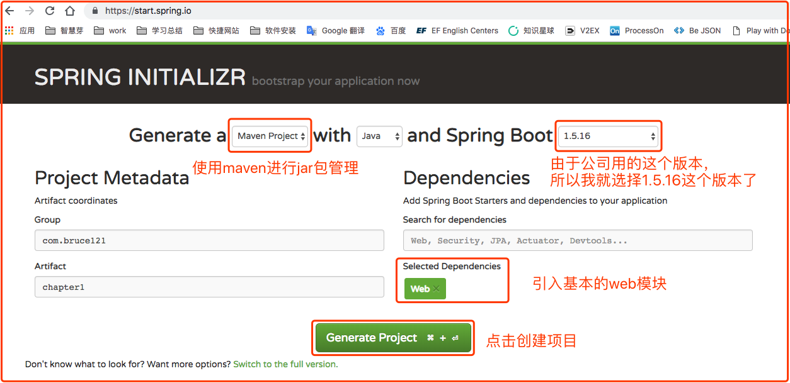
2.使用IDE导入项目
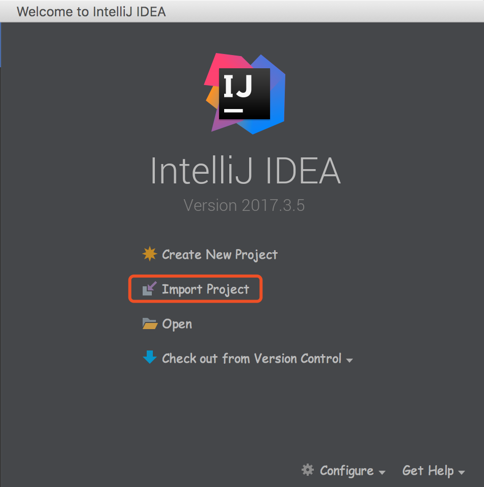

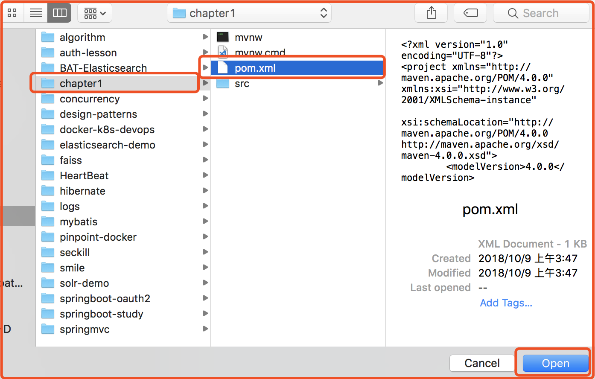

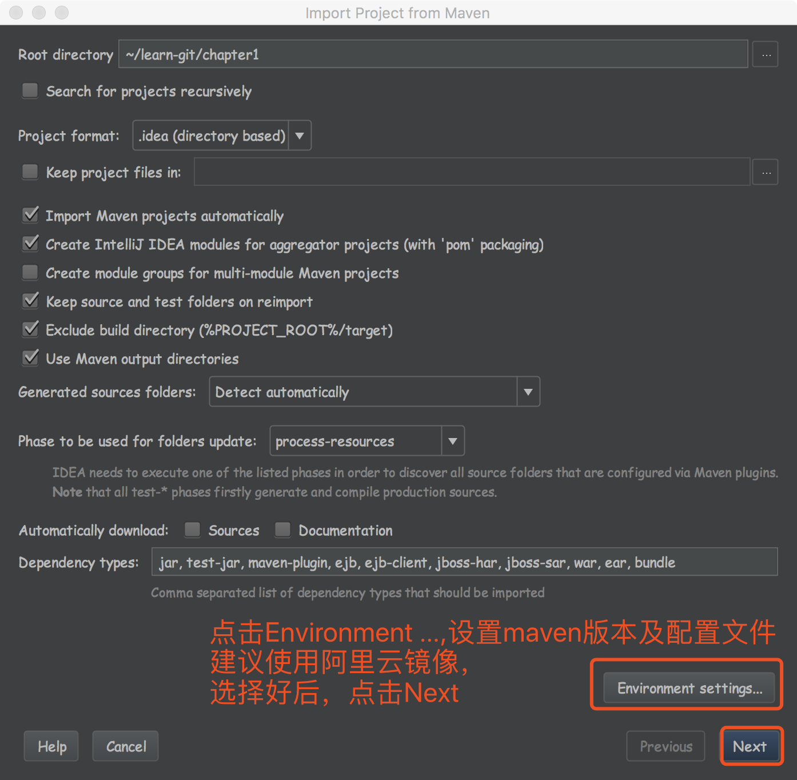

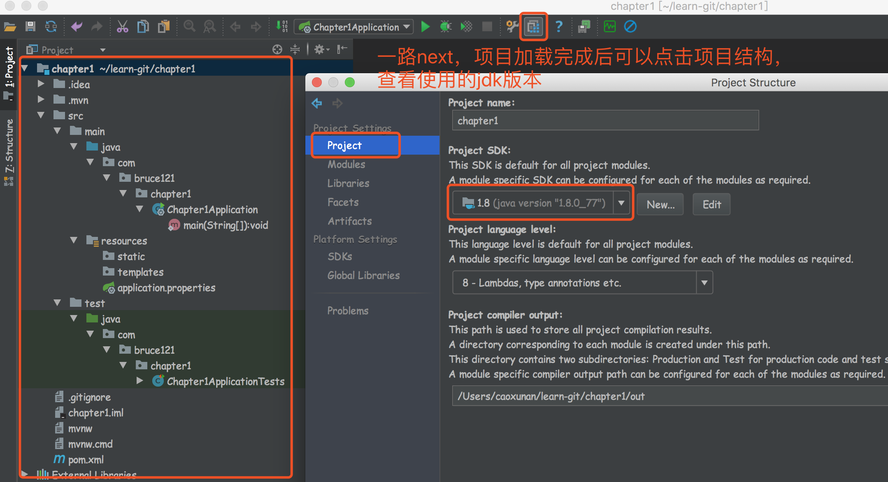
至此，项目构建完毕
##### 方式二：通过IDE自带的功能
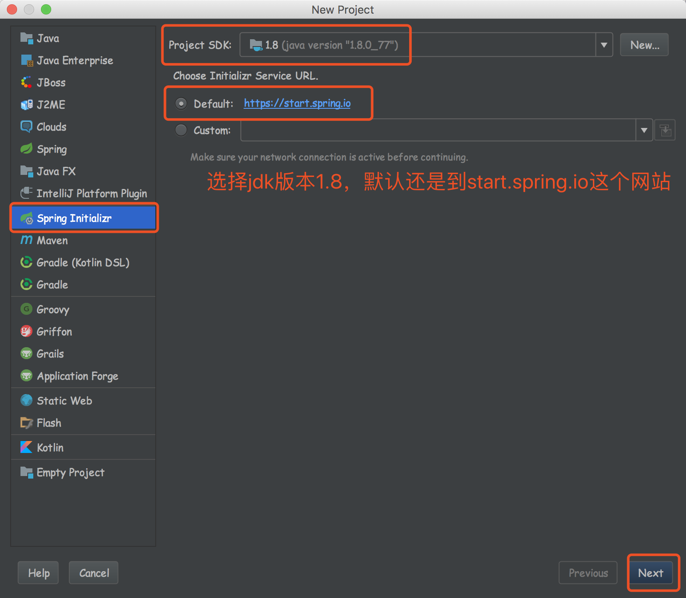

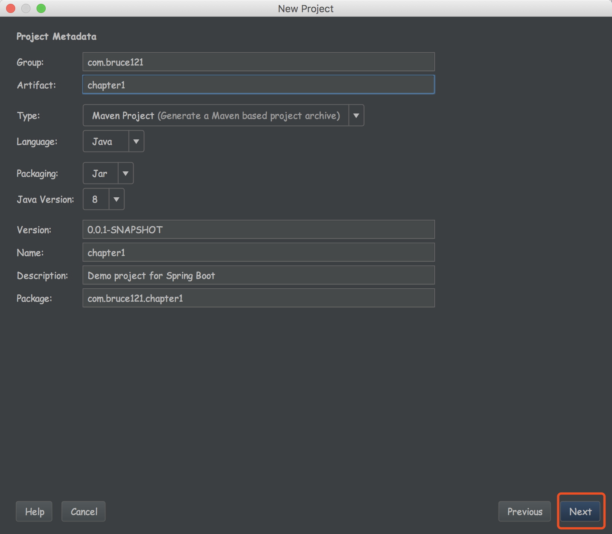

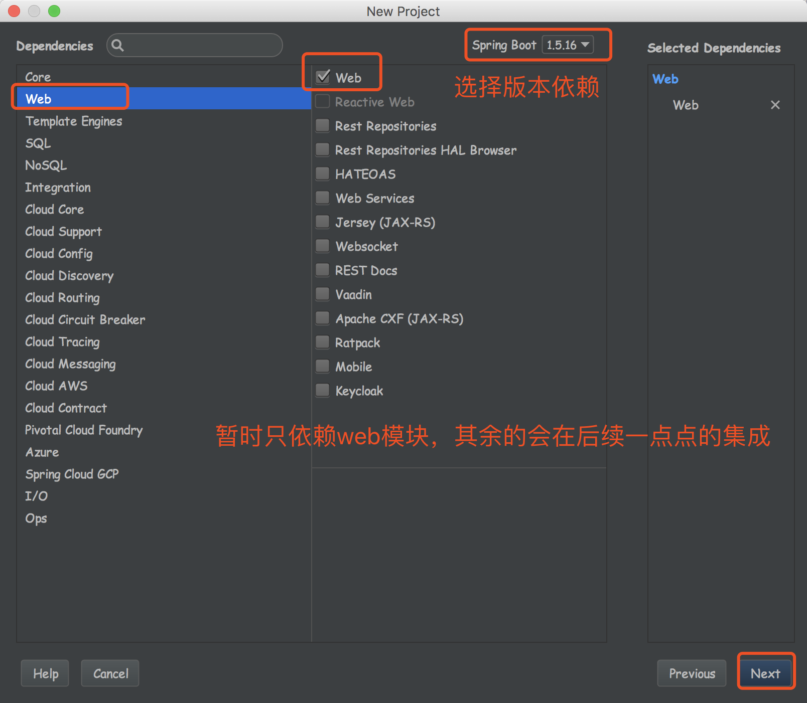
一路next，项目构建完毕
##### 方式三：新建空白maven项目，然后引入pom配置文件
1.设置新建maven项目的parent
说明：Springboot的项目必须要将parent设置为springboot的parent，该parent包含了大量默认的配置，大大简化了我们的开发。
```
<!-- 该parent包含了大量默认的配置，简化开发 -->
<parent>
    <groupId>org.springframework.boot</groupId>
    <artifactId>spring-boot-starter-parent</artifactId>
    <version>1.5.16.RELEASE</version>
</parent>
```
2.导入Spring Boot的web支持
```
<dependency>
    <groupId>org.springframework.boot</groupId>
    <artifactId>spring-boot-starter-web</artifactId>
</dependency>
```
3.Spring Boot Maven插件（可以不添加）
```
<build>
   <plugins>
      <plugin>
         <groupId>org.springframework.boot</groupId>
         <artifactId>spring-boot-maven-plugin</artifactId>
      </plugin>
   </plugins>
</build>
```
4.编写springboot的启动类
```
package com.bruce121.chapter1;

import org.springframework.boot.SpringApplication;
import org.springframework.boot.autoconfigure.SpringBootApplication;

@SpringBootApplication
public class Chapter1Application {

   public static void main(String[] args) {
      SpringApplication.run(Chapter1Application.class, args);
   }
}
```
到此，第三种方式构建Spring Boot项目，构建完毕

#### 2.新建一个Controller

```
package com.bruce121.chapter1.controller;

import org.springframework.web.bind.annotation.RequestMapping;
import org.springframework.web.bind.annotation.RestController;

/**
 * Author: Bruce121
 * Date: 2018-10-09
 */
@RestController
public class DemoController {

    @RequestMapping("/hello")
    public String index() {
        return "Hello World!";
    }

}
```

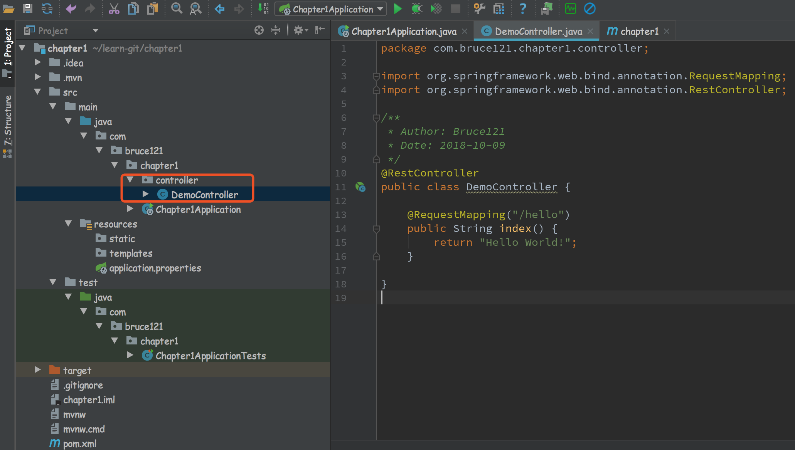

#### 3.启动测试：
运行Chapter1Application的main方法，看一下启动效果
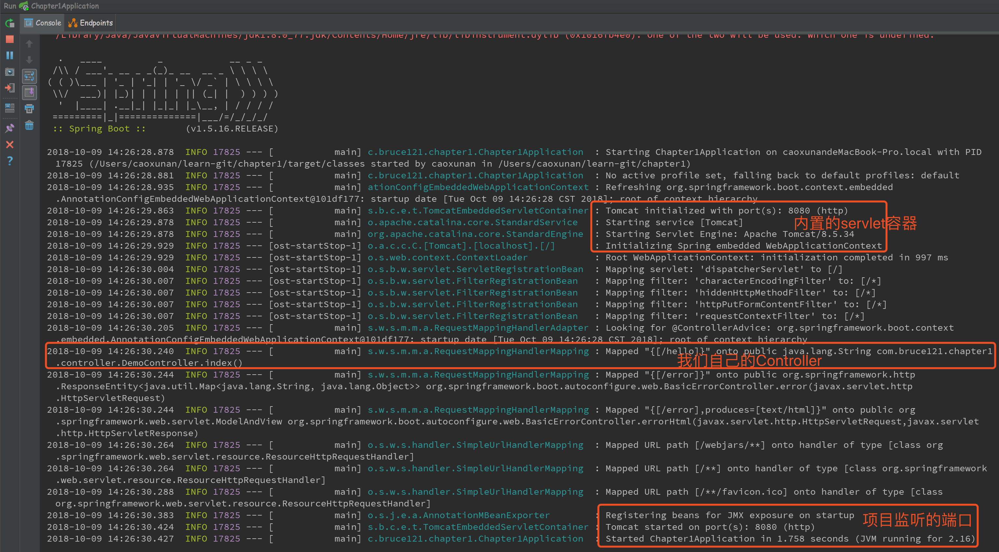

#### 4.访问测试：
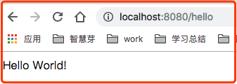

至此，一个最简单的springboot项目就搭建好了


