# 从头学SpringBoot系列(三) JavaBeanConfig与配置篇
目录
===
   * [前言](#前言)
   * [正文](#正文)
      * [一、传统xml配置bean的方式：](#一传统xml配置bean的方式)
         * [1.新建Bruce121.java](#1新建bruce121java)
         * [2.在resources下新建demo-config.xml](#2在resources下新建demo-configxml)
         * [3.在启动类上添加@ImportResource("classpath:demo-config.xml”)让Springboot加载指定xml文件](#3在启动类上添加importresourceclasspathdemo-configxml让springboot加载指定xml文件)
         * [4.新建Controller进行测试](#4新建controller进行测试)
         * [5.访问测试](#5访问测试)
      * [二、Java Bean配置方式](#二java-bean配置方式)
         * [1.application.properties中添加配置](#1applicationproperties中添加配置)
         * [2.在需要的地方使用@Value("${config.name}”)](#2在需要的地方使用valueconfigname)
         * [3.访问测试](#3访问测试)
         * [4.快捷绑定多个属性](#4快捷绑定多个属性)
         * [5.注入到其他Bean中](#5注入到其他bean中)
         * [6.在controller](#6在controller)
         * [7.访问测试](#7访问测试)
      * [三、简单引申一下多数据源如何配置](#三简单引申一下多数据源如何配置)
         * [1.配置文件添加第二套配置](#1配置文件添加第二套配置)
         * [2.绑定第二套参数](#2绑定第二套参数)
         * [3.在BeanConfig中装配第二套参数到到同类的Bean中](#3在beanconfig中装配第二套参数到到同类的bean中)
         * [4.在controller](#4在controller)
         * [5.访问测试](#5访问测试-1)
      * [四、多环境配置](#四多环境配置)
         * [1.添加多个配置文件](#1添加多个配置文件)
         * [2.使用@Profile注解指定配置文件](#2使用profile注解指定配置文件)
         * [3.使用自定义的app.properties配置文件装配bean](#3使用自定义的appproperties配置文件装配bean)
      * [六、使用命令行启动时的外部配置方式](#六使用命令行启动时的外部配置方式)
         * [1.打包](#1打包)
         * [2.进入target目录,使用java -jar 启动SpringBoot项目](#2进入target目录使用java--jar-启动springboot项目)
         * [3.访问测试](#3访问测试-1)
      * [七、参数间的相互引用](#七参数间的相互引用)
## 前言
   SpringBoot推荐我们使用JavaBean配置的方式来代替xml配置，这篇文章就总结一下JavaBean配置的方式以及SpringBoot配置文件application.properties的使用。
## 正文
简单来讲，使用xml配置和Java类配置的方式实现的功能是一样的，都是为了创建Bean，并且注入IOC容器。

最终目录结构：

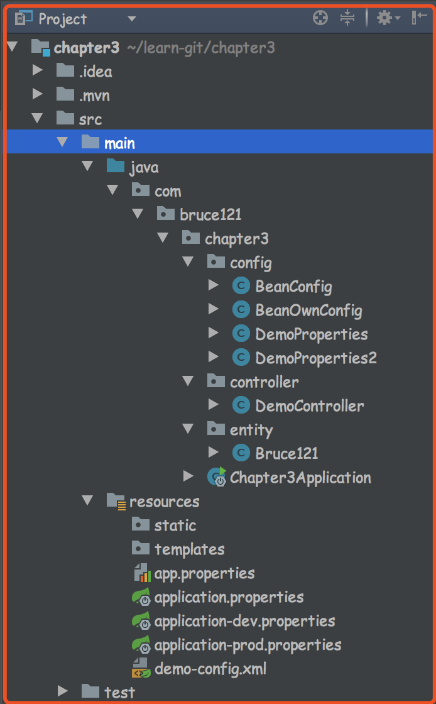
### 一、传统xml配置bean的方式：
#### 1.新建Bruce121.java
```
@Setter
@Getter
public class Bruce121{
    private String name;
    private String website;

    public Bruce121() {
    }

    public Bruce121(String name, String website) {
        this.name = name;
        this.website = website;
    }
}
```
#### 2.在resources下新建demo-config.xml
```
<?xml version="1.0" encoding="UTF-8"?>
<beans xmlns="http://www.springframework.org/schema/beans"
       xmlns:xsi="http://www.w3.org/2001/XMLSchema-instance"
       xsi:schemaLocation="http://www.springframework.org/schema/beans
       http://www.springframework.org/schema/beans/spring-beans.xsd">

    <bean id="demoBruce" class="com.bruce121.chapter3.entity.Bruce121">
        <property name="name" value="Bruce121-xml"/>
        <property name="website" value="www.bruce121.com xml"/>
    </bean>

</beans>
```
#### 3.在启动类上添加@ImportResource("classpath:demo-config.xml”)让Springboot加载指定xml文件
```
@SpringBootApplication
@ImportResource("classpath:demo-config.xml")
public class Chapter3Application {
   public static void main(String[] args) {
      SpringApplication.run(Chapter3Application.class, args);
   }
}
```
#### 4.新建Controller进行测试
```
@RestController
public class DemoController {
    @Autowired // 注意：这里的demoBruce要和xml中配置的相同
    Bruce121 demoBruce;

    @RequestMapping(path = "/demoBruce", method = RequestMethod.GET)
    public String demoBruce(){
        return demoBruce.getName() + " : " + demoBruce.getWebsite();
    }
}
```
#### 5.访问测试
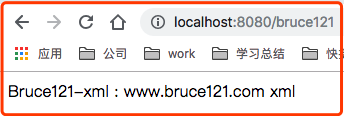
### 二、Java Bean配置方式
#### 1.application.properties中添加配置
```
com.bruce121.demo.name=bruce121
com.bruce121.demo.website=www.bruce121.com
```
#### 2.在需要的地方使用@Value("${config.name}”)
```
@Value("${com.bruce121.demo.name}")
private String name;
@Value("${com.bruce121.demo.website}")
private String website;

@RequestMapping(path = "/index", method = RequestMethod.GET)
public String index(){
    return name + " : " + website;
}
```
#### 3.访问测试
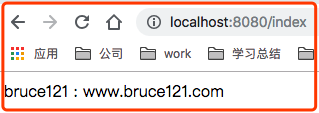
#### 4.快捷绑定多个属性
`使用@ConfigurationProperties(prefix = "com.bruce121.demo")`
```
@Getter
@Setter
@Component // 如果不使用这个注解把该类装配成Bean，也可以在其他Bean的类头添加@EnableConfigurationProperties({DemoProperties.class})来手动指定要装配的bean
// @ConfigurationProperties可以实现将以prefix开头的配置绑定到该类的属性中
@ConfigurationProperties(prefix = "com.bruce121.demo")
public class DemoProperties {
    private String name;    // 自动绑定com.bruce121.demo.name的值
    private String website; // 自动绑定com.bruce121.demo.website的值
}
```
#### 5.注入到其他Bean中
如下：直接引出另一种配置Bean的方式
```
@Configuration // @Configuration理解成是一个xml文件
public class BeanConfig {

    @Autowired
    DemoProperties demoProperties;

    @Bean    // @Bean相当于xml文件中的<bean></bean>标签
    public Bruce121 beanBruce(DemoProperties demoProperties){
        return new Bruce121(demoProperties.getName(), demoProperties.getWebsite());
    }

}
```
#### 6.在controller
```
@Autowired
private Bruce121 beanBruce;

@RequestMapping(path = "/beanBruce", method = RequestMethod.GET)
public String beanBruce(){
    return beanBruce.getName() + " : " + beanBruce.getWebsite();
}
```
#### 7.访问测试
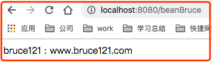
### 三、简单引申一下多数据源如何配置
#### 1.配置文件添加第二套配置
```
com.bruce121.demo2.name=bruce121-->name
com.bruce121.demo2.website=www.bruce121.com-->website
```
#### 2.绑定第二套参数
```
@Getter
@Setter
@Component
@ConfigurationProperties(prefix = "com.bruce121.demo2")
public class DemoProperties2 {
    private String name;
    private String website;
}
```
#### 3.在BeanConfig中装配第二套参数到到同类的Bean中
```
@Autowired
DemoProperties2 demoProperties2;

@Bean
public Bruce121 beanBruce2(DemoProperties2 demoProperties2){
    return new Bruce121(demoProperties2.getName(), demoProperties2.getWebsite());
}
```
#### 4.在controller
```
@Autowired  // 简单来讲就是根据不同的名称来指向不同参数所装配的bean
private Bruce121 beanBruce2;

@RequestMapping(path = "/beanBruce2", method = RequestMethod.GET)
public String beanBruce2(){
    return beanBruce2.getName() + " : " + beanBruce2.getWebsite();
}
```
#### 5.访问测试

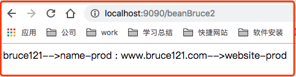
### 四、多环境配置
#### 1.添加多个配置文件
通过`spring.profiles.active=env`的方式指定具体激活哪个配置
SpringBoot默认会加classpath下的application.properties或者application.yml

PS：将application.properties放在`src/main/resources/config`目录下一样可用，且会覆盖classpath下的application.properties中相同的属性，但一般情况下不会有同名的多个配置，因为多环境的配置可以像下面这样。

SpringBoot中多个环境的配置文件名格式为：
`application-{profile}.properties`
然后可以通过`spring.profiles.active={profile}`来指定Springboot加载哪个配置文件

例如：
`spring.profiles.active=dev`
则指定加载`application-dev.properties`这个配置文件。
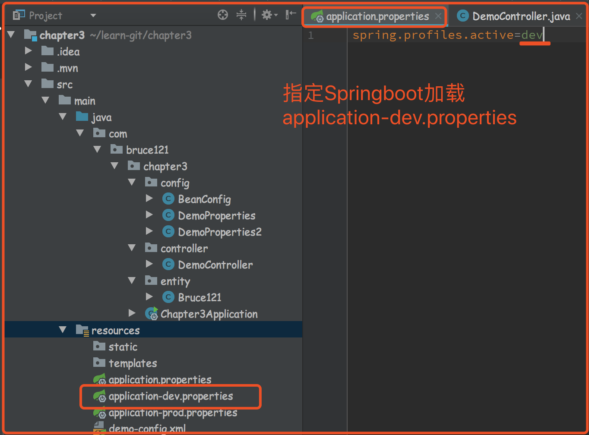
#### 2.使用@Profile注解指定配置文件
（使用这种方式也可以实现切换数据源的效果，但不推荐）
直接看@Profile的注释比较好（copy过来一部分）：
```
If a @Configuration class is marked with @Profile, all of the @Bean methods and @Import annotations associated with that class will be bypassed unless one or more of the specified profiles are active. This is analogous to the behavior in Spring XML: if the profile attribute of the beans element is supplied e.g., <beans profile="p1,p2">, the beans element will not be parsed unless at least profile 'p1' or 'p2' has been activated. Likewise, if a @Component or @Configuration class is marked with @Profile({"p1", "p2"}), that class will not be registered or processed unless at least profile 'p1' or 'p2' has been activated.
If a given profile is prefixed with the NOT operator (!), the annotated component will be registered if the profile is not active — for example, given @Profile({"p1", "!p2"}), registration will occur if profile 'p1' is active or if profile 'p2' is not active.
If the @Profile annotation is omitted, registration will occur regardless of which (if any) profiles are active.
```
#### 3.使用自定义的app.properties配置文件装配bean

1.app.properties

```
com.bruce121.own.name=own-diy
com.bruce121.own.website=own-diy-website
```

2.新建BeanOwnConfig

```
@Getter
@Setter
@Configuration
@ConfigurationProperties(prefix = "com.bruce121.own")
@PropertySource("classpath:app.properties”) // 指定装配哪个配置文件中的配置
public class BeanOwnConfig {

    private String name;
    private String website;

    @Autowired // 可以用env以key-value的方式获取任意的配置
    private Environment env;

    @Bean
    public Bruce121 beanBruce3() {
        // String name = env.getProperty("com.bruce121.own.name"); // own-diy
        // String website = env.getProperty("com.bruce121.own.website"); // own-diy-website
        return new Bruce121(name, website);
    }

}
```

3.在controller中

```
@Autowired
private Bruce121 beanBruce3;

@RequestMapping(path = "/beanBruce3", method = RequestMethod.GET)
public String beanBruce3(){
    return beanBruce3.getName() + " : " + beanBruce3.getWebsite();
}
```

4.访问测试

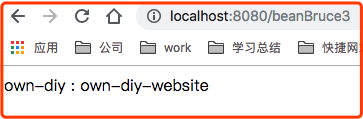
### 六、使用命令行启动时的外部配置方式
SpringBoot项目打成jar包之后，可以直接通过java -jar的方式启动运行，这个时候也可以控制程序使用指定的配置文件
#### 1.打包
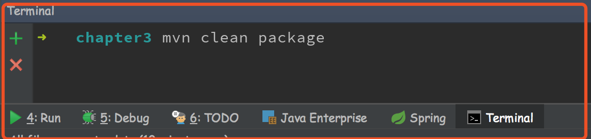
#### 2.进入target目录,使用java -jar 启动SpringBoot项目
```
java -jar chapter3-0.0.1-SNAPSHOT.jar --spring.profiles.active=prod --server.port=9090
```
`--spring.profiles.active`称之为命令行参数，使用命令行参数会覆盖自己配置文件中同名参数，这样就实现了jar方式包启动时指定配置文件及修改参数的目的。
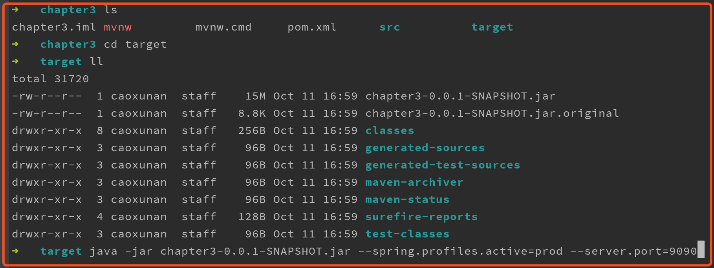
#### 3.访问测试

PS：使用Idea模拟命令行参数
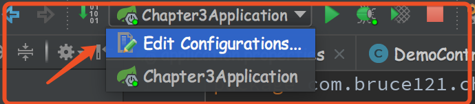

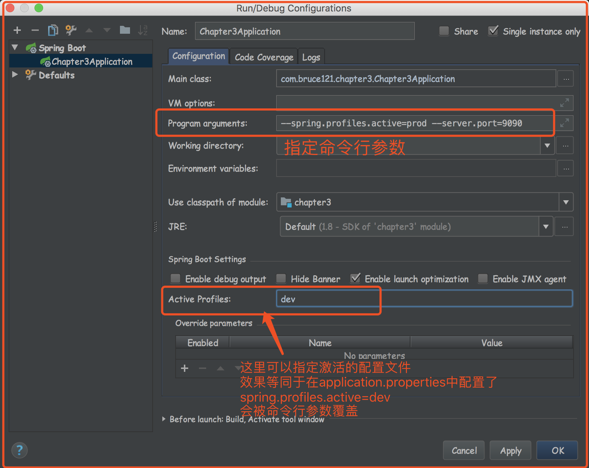
### 七、参数间的相互引用
```
# application.properties的参数间可以相互引用
# com.bruce.demo.all=名称${com.bruce121.demo.name}网址${com.bruce121.demo.website}
# 相当于com.bruce.demo.all=名称bruce21网址www.bruce121.com
```
因为Springboot配置文件具有优先级以及引用的特性，所以在实际开发中我们经常可以看到如下的配置方式：
```
spring.profiles.active=${WEBAPI_MODE:dev}
## server HTTP port.
server.port=${WEBAPI_PORT:19083}
```
 `${WEBAPI_MODE:dev}` 含义是：
 如果`WEBAPI_MODE`这个变量存在，则引用这个变量的值。
 如果`WEBAPI_MODE`不存在，则默认使用`dev`
**PS**：因为springboot可以从多处地方读取配置的属性，常用的有如下几种（按优先级排序）
1.命令行参数 
2.JVM系统属性 
3.操作系统环境变量 
4.application.properties或者application.yml文件

这样我们就可以理解为什么`可以使用命令行覆盖配置文件中配置的属性`了，因为`命令行中的参数优先级最高`，然后这样也可以自行实现外部配置属性，只要`程序启动后先把某些配置加载到系统环境变量中`就可以了。
**PS2**:完整的读取参数的优先级可以参照官方文档（没必要全列一边，需要的时候去官方文档查一查，什么都有了）
文档链接：[https://docs.spring.io/spring-boot/docs/1.5.16.RELEASE/reference/htmlsingle/#boot-features-external-config](https://docs.spring.io/spring-boot/docs/1.5.16.RELEASE/reference/htmlsingle/#boot-features-external-config)
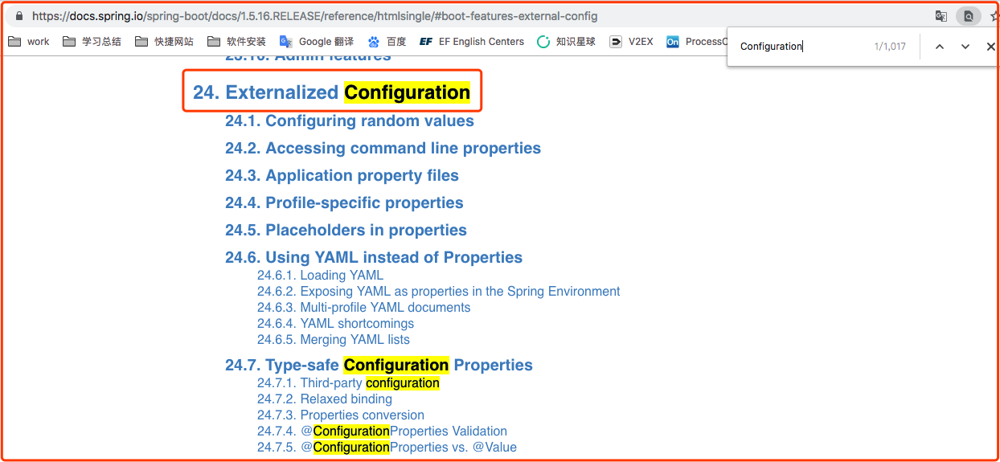