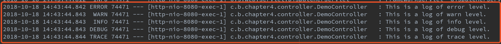

# 从头学Springboot系列（四）日志篇 logback配置解析
目录
=====
   * [前言：](#前言)
   * [正文：](#正文)
      * [一、日志的默认配置](#一日志的默认配置)
         * [1.Log format](#1log-format)
         * [2.Console output](#2console-output)
            * [Color-coded output](#color-coded-output)
         * [3.File output，将日志输出至文件](#3file-output将日志输出至文件)
         * [4.日志级别](#4日志级别)
      * [二、使用自定义日志配置文件](#二使用自定义日志配置文件)
         * [1.使用logging.config来使用指定的日志配置文件](#1使用loggingconfig来使用指定的日志配置文件)
         * [2.各标签解释](#2各标签解释)
         * [3.演示日志切分](#3演示日志切分)
## 前言：
   出现操作和预期得到的结果不一致的情形(bug)后，日志可以帮助我们快速定位问题。所以说，程序员不怕有bug，就怕有bug却不报错又没有日志，找起bug来，那个酸爽，碰到过的人都明白。

参照：[https://docs.spring.io/spring-boot/docs/1.5.16.RELEASE/reference/htmlsingle/](https://docs.spring.io/spring-boot/docs/1.5.16.RELEASE/reference/htmlsingle/)

## 正文：
### 一、日志的默认配置
SpringBoot对各种日志框架都做了支持，我们可以通过修改application.properties的方式来修改日志的默认配置
```
2018-10-16 10:06:03.755  INFO 63438 --- [           main] o.s.w.s.handler.SimpleUrlHandlerMapping  : Mapped URL path [/webjars/**] onto handler of type [class org.springframework.web.servlet.resource.ResourceHttpRequestHandler]
2018-10-16 10:06:03.755  INFO 63438 --- [           main] o.s.w.s.handler.SimpleUrlHandlerMapping  : Mapped URL path [/**] onto handler of type [class org.springframework.web.servlet.resource.ResourceHttpRequestHandler]
2018-10-16 10:06:03.807  INFO 63438 --- [           main] o.s.w.s.handler.SimpleUrlHandlerMapping  : Mapped URL path [/**/favicon.ico] onto handler of type [class org.springframework.web.servlet.resource.ResourceHttpRequestHandler]
2018-10-16 10:06:03.978  INFO 63438 --- [           main] o.s.j.e.a.AnnotationMBeanExporter        : Registering beans for JMX exposure on startup
2018-10-16 10:06:04.023  INFO 63438 --- [           main] s.b.c.e.t.TomcatEmbeddedServletContainer : Tomcat started on port(s): 8080 (http)
2018-10-16 10:06:04.029  INFO 63438 --- [           main] c.bruce121.chapter4.Chapter4Application  : Started Chapter4Application in 2.088 seconds (JVM running for 2.753)
```
#### 1.Log format

1. 输出的元素有：
2. Date and Time,格式为yyyy-MM-dd HH:mm:ss.SSS
3. 日志级别：ERROR, WARN, INFO, DEBUG, TRACE
4. Process ID 进程id
5. --- 分隔符,分隔前后内容
6. 线程名称，上面贴的代码显示是主线程
7. Logger的名字，通常缩写
8. 日志内容

#### 2.Console output
   默认的日志配置将在写入时将信息打印至控制台，默认打印ERROR，WARN 和 INFO级别的日志，我们也可以通过命令行启动debug模式，如下
```
java -jar myapp.jar —-debug
```
等同于在application.properties中添加debug=true
当开启了debug模式时，默认会有一系列的logger（embeded container，Hiberate，SpringBoot）可以输出更多的信息。
或者，你也可以启动trace模式来启动应用，在命令行使用
```
java -jar myapp.jar --trace
```
或者在application.properties中添加`trace=true`
这样将会启动一系列的logger来以trace级别来打印日志信息。
##### Color-coded output
如果你的terminal支持ANSI，日志将会以颜色的区分来增加可读性。

代码颜色的配置是通过使用%clr来实现转换的
%clr,使用方式为%clr(内容){颜色}
我们把SpringBoot默认的日志格式贴出来看看(涉及到前一篇中提到的配置的引用)
```
logging.pattern.console=${CONSOLE_LOG_PATTERN:%clr(%d{yyyy-MM-dd HH:mm:ss.SSS}){faint} %clr(${LOG_LEVEL_PATTERN:-%5p}) %clr(${PID:- }){magenta} %clr(---){faint} %clr([%15.15t]){faint} %clr(%-40.40logger{39}){cyan} %clr(:){faint} %m%n${LOG_EXCEPTION_CONVERSION_WORD:-%wEx}}
```
其中faint是默认不使用Color-coded，我们把DateTime 的faint改成red看一下效果


吓人不？每次控制台打印出现红色字体，都会不自觉的认为是bug。。。

支持的颜色类型有：`blue, cyan, faint, green, magenta, red, yellow`.

**PS**：代码颜色区别显示只是为了增加可读性。。但是不知道为什么打印日志级别没有指定颜色会显示黄色。
#### 3.File output，将日志输出至文件
默认情况下，SpringBoot只会把日志输出至控制台，不会写入日志文件，如果我们需要(肯定需要啊)把日志输出至文件，我们可以配置logging.file或者logging.path属性（在application.properties or 命令行 or 环境变量 or …）
```
#
# logging configuration
# logging.file=my.log 指定具体的日志文件
# logging.path=/opt/apps/logs/ 指定目录，日志文件名称为spring.log
# logging.pattern.file=${FILE_LOG_PATTERN} 控制输出的文件的格式
#
logging.pattern.file=${FILE_LOG_PATTERN:-%d{yyyy-MM-dd HH:mm:ss.SSS} ${LOG_LEVEL_PATTERN:-%5p} ${PID:- } --- [%t] %-40.40logger{39} : %m%n${LOG_EXCEPTION_CONVERSION_WORD:-%wEx}}
logging.file=logs/spring-study-demo.log
```
PS: 日志文件每10M切分一次。
#### 4.日志级别
默认日志级别是INFO，也可以控制特定包下的日志以指定日志级别输出
```
# logging.level.root=info 设置跟日志记录器的日志级别
# logging.level.org.springframework.web=debug指定特定的包路径下日志级别为debug
logging.level.root=info
logging.level.org.springframework.web=debug
```
### 二、使用自定义日志配置文件
#### 1.使用logging.config来使用指定的日志配置文件

SpringBoot支持很多日志系统,基于你使用的日志系统，下列文件会被默认加载：


**PS**:
1. 日志的配置在生成程序上下文之前进行初始化的，所以无法在@Configuration文件中使用@PropertySources来控制logging的配置，只有一个方式就是通过System properties（命令行或配置文件或其他）
2. 强烈建议在日志的配置文件名称中添加-spring来使用，例如
logback-spring.xml要好于logbook.xml
如果使用原始配置文件名的话（不加-spring），spring无法完全控制日志的初始化
我们可以使用logging.config来指定使用的日志配置：
```
logging.config=classpath:logback-config.xml
```
在resources下新建logback-config.xml
```
<?xml version="1.0" encoding="UTF-8"?>
<!--详细配置参见http://logback.qos.ch/manual/configuration.html-->
<configuration debug="false">
    <!--
        引入其他xml文件,如果找不到指定的配置文件，logback会有所警告，可以通过设置optional="true"来忽略警告
        The contents to include can be referenced as a file, as a resource, or as a URL.
    -->
    <include optional="true" resource="console-output.xml"/>

    <!--特殊字母相关的转换器-->
    <conversionRule conversionWord="clr"
                    converterClass="org.springframework.boot.logging.logback.ColorConverter"/>
    <conversionRule conversionWord="wex"
                    converterClass="org.springframework.boot.logging.logback.WhitespaceThrowableProxyConverter"/>
    <conversionRule conversionWord="wEx"
                    converterClass="org.springframework.boot.logging.logback.ExtendedWhitespaceThrowableProxyConverter"/>

    <!-- 相当于String key=value; 定义参数，可以使用${key}的方式获得value值 -->
    <property name="CONSOLE_LOG_PATTERN"
              value="${CONSOLE_LOG_PATTERN:-%clr(%d{yyyy-MM-dd HH:mm:ss.SSS}){faint} %clr(${LOG_LEVEL_PATTERN:-%5p}) %clr(${PID:- }){magenta} %clr(---){faint} %clr([%15.15t]){faint} %clr(%-40.40logger{39}){cyan} %clr(:){faint} %m%n${LOG_EXCEPTION_CONVERSION_WORD:-%wEx}}"/>
    <property name="FILE_LOG_PATTERN"
              value="${FILE_LOG_PATTERN:-%d{yyyy-MM-dd HH:mm:ss.SSS} ${LOG_LEVEL_PATTERN:-%5p} ${PID:- } --- [%t] %-40.40logger{39} : %m%n${LOG_EXCEPTION_CONVERSION_WORD:-%wEx}}"/>

    <!-- allow logging pattern override -->
    <include optional="true" resource="logback-logging-pattern-override.xml"/>

    <!-- Logback的appenders详细配置可以查看：https://logback.qos.ch/manual/appenders.html-->
    <!-- 配置name为console的输出源为ConsoleAppender（输出到控制台） -->
    <appender name="console" class="ch.qos.logback.core.ConsoleAppender">
        <encoder>
            <!-- 设置该输出源的布局格式 -->
            <pattern>${CONSOLE_LOG_PATTERN}</pattern>
        </encoder>
    </appender>

    <!--输出到文件,会随着文件大小和时间的变化根据指定的策略对日志进行切分-->
    <appender name="file" class="ch.qos.logback.core.rolling.RollingFileAppender">
        <!---->
        <file>logs/spring-boot-study.log</file>
        <!-- 定义日志文件大小及时间策略 -->
        <rollingPolicy class="ch.qos.logback.core.rolling.SizeAndTimeBasedRollingPolicy">
            <fileNamePattern>logs/spring-boot-study.%d{yyyy-MM-dd}.%i.log</fileNamePattern>
            <!-- each file should be at most 100MB, keep 60 days worth of history, but at most 20GB -->
            <!-- 当每个文件的大小达到100MB的时候，会自动生成新的日志文件，日志文件最多保存60天，如果总日志大小超过10G的话，会删除旧的日志-->
            <maxFileSize>100MB</maxFileSize>
            <maxHistory>60</maxHistory>
            <totalSizeCap>10GB</totalSizeCap>
        </rollingPolicy>

        <encoder>
            <pattern>Bruce App | ${FILE_LOG_PATTERN}</pattern>
        </encoder>
    </appender>

    <!--
        日志不仅仅可以保存在本地，还可以写到远程服务器
        远程服务器需要安装及配置syslog服务（略）
    -->
    <!--<appender name="APP_SYSLOG" class="ch.qos.logback.classic.net.SyslogAppender">-->
        <!--<syslogHost>${remote_ip}</syslogHost>-->
        <!--<port>514</port>-->
        <!--<facility>LOCAL1</facility>-->
        <!--<suffixPattern>${FILE_LOG_PATTERN}</suffixPattern>-->
    <!--</appender>-->

    <!--
        介绍：https://blog.windrunner.me/tool/sentry.html
        需要使用Sentry的话可以引入面的依赖（略）
        <dependency>
            <groupId>io.sentry</groupId>
            <artifactId>sentry-logback</artifactId>
            <version>1.7.4</version>
        </dependency>
    -->
    <!--<appender name="SENTRY_COLLECTOR" class="io.sentry.logback.SentryAppender">-->
        <!--
            http://logback.qos.ch/manual/filters.html#thresholdFilter
            一个日志级别的阀值过滤器，只会打印出指定级别及以上的日志（该类的注释中写的）
            例如指定level为WARN，那么只会打印出WARN和ERROR级别的日志
        -->
        <!--<filter class="ch.qos.logback.classic.filter.ThresholdFilter">-->
            <!--<level>${sentry.level.threshold:-ERROR}</level>-->
        <!--</filter>-->
    <!--</appender>-->

    <!-- allow additional logback settings -->
    <include optional="true" resource="logback-overrides.xml"/>

    <!--
        logger：日志记录器 有name，level，additivity三个属性
        name：可以具体到类，也可以具体到包名
        level：默认info级别
        ps：name结合level的含义就是某个包（类）里面的日志的输出级别，
        additivity: 默认true，意思是此logger输出的信息会向 根日志记录器传递（即：root logger）
        下面的配置：相当于在application.properties中配置logging.level.com.bruce121.chapter4.controller.LoggerController=trace
    -->
    <logger name="com.bruce121.chapter4.controller.LoggerController" level="trace" additivity="true">
        <!--
            触发此logger输出条件的话，会引用哪些appender进行输出
            例如触发该日志记录器：
            1.使用该 logger 所引用的console这个appender向控制台输出了日志信息
            2.再根据 additivity 的属性决定是否向根日志记录器传递
            3.如果传递给了 root logger，那么直接会使用root logger 所配置的appender进行处理,如果没传递则结束本次日志处理
            ps:这种日志的传递的特性可以实现不同位置的日志使用不同的策略进行处理
               但是，一般情况下都只会指定 具体的包（类）的日志级别，然后additivity传递特性默认为true，即自己不操心，让root logger操心去吧～
        -->
        <appender-ref ref="console"/>
    </logger>

    <!-- 配置根日志记录器 -->
    <root level="info">
        <!-- 引用上面配置的appender -->
        <appender-ref ref="console"/>
        <appender-ref ref="file"/>
        <!--<appender-ref ref="SENTRY_COLLECTOR"/>-->
    </root>

</configuration>
```
console-output.xml
```
<?xml version="1.0" encoding="UTF-8"?>
<included>
    <!-- 输出至控制台 -->
    <appender name="another_file" class="ch.qos.logback.core.FileAppender">
        <file>logs/another_file.log</file>
        <encoder>
            <pattern>%date %level [%thread] %logger{10} [%file:%line] %msg%n</pattern>
        </encoder>
    </appender>

    <root level="info">
        <appender-ref ref="another_file" />
    </root>

</included>
```
#### 2.各标签解释
具体的解释都标注在了配置文件中，不做过多解释。
在controller中添加一个测试路径
```
@GetMapping(path = "/print/log")
public String pringLog(){
    logger.error("This is a log of error level.");
    logger.warn("This is a log of warn level.");
    logger.info("This is a log of info level.");
    logger.debug("This is a log of debug level.");
    logger.trace("This is a log of trace level.");
    return "success";
}
```
使用上面贴出来的配置，进行访问测试：`http://localhost:8080/print/log`

可以发现每一条消息都被打印了2次，但是打开日志文件看一下，却发现只有一次

具体的解释全在配置文件中。

**PS**：因为xml的元素加载顺序是从上至下的，所以说在xml下方可以自己添加配置来覆盖上方的配置
写了一个死循环来打印日志展示日志的切分：
#### 3.演示日志切分
```
@RestController
public class LoggerController implements InitializingBean{
    private static Logger logger = LoggerFactory.getLogger(LoggerController.class);
    @Override
    public void afterPropertiesSet() throws Exception {
        while (true){
            logger.info("这是一个死循环，为了展示日志切分。。。");
        }
    }
    @GetMapping(path = "/print/log")
    public String pringLog(){
        logger.error("This is a log of error level.");
        logger.warn("This is a log of warn level.");
        logger.info("This is a log of info level.");
        logger.debug("This is a log of debug level.");
        logger.trace("This is a log of trace level.");
        return "success";
    }
}
```

最终切分的效果

