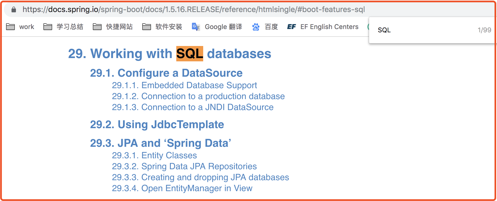

# 从头学SpringBoot系列(六) SQL数据库存储之mysql及多数据源配置解析
## 目录
* [前言](#前言)
* [正文](#正文)
   * [一、使用原始方式](#一使用原始方式)
      * [1.导入pom依赖](#1导入pom依赖)
      * [2.新建实体类User.java](#2新建实体类userjava)
      * [3.核心部分代码](#3核心部分代码)
      * [4.访问测试](#4访问测试)
   * [二、使用spring-boot-starter-jdbc](#二使用spring-boot-starter-jdbc)
      * [1.引入pom依赖](#1引入pom依赖)
      * [2.添加数据源配置](#2添加数据源配置)
      * [3.修改UserDao代码](#3修改userdao代码)
         * [UserDao.java](#userdaojava)
         * [UserServiceImpl.java](#userserviceimpljava)
         * [UserController.java](#usercontrollerjava)
   * [三、使用自定义数据源](#三使用自定义数据源)
      * [1.简单数据源创建源码分析](#1简单数据源创建源码分析)
      * [2.构造自定义数据源](#2构造自定义数据源)
         * [a.pom导入依赖及配置](#apom导入依赖及配置)
         * [b.配置DataSource的Bean](#b配置datasource的bean)
         * [c.打断点查看效果](#c打断点查看效果)
   * [四、使用多数据源](#四使用多数据源)
      * [1.添加配置Bean和配置文件](#1添加配置bean和配置文件)
      * [2.UserDao中引入第二个JdbcTemplate](#2userdao中引入第二个jdbctemplate)
      * [3.打断点验证](#3打断点验证)
## 前言
事实上很多技术都可以从官方文档中找到解决方案，很多博客也都是把从各方面找到的内容自己啃一遍，然后再吐出来，当然还是有很多大神的博客是自己烹饪出来的内容。
而我想做的是把这个啃的过程，记录下来，这样以后再碰到新的不懂的技术的时候，可以知道该怎么自己去啃，也希望可以帮助到你。
这篇文章就根据官方文档啃一下操作SQL数据库。
目标是展示不同种方式操作mysql数据库，包括但不限于
1. 使用原始jdbc方式
2. 使用spring-boot-starter-jdbc中的jdbcTemplate方式
3. 使用自定义数据源（druid）

参考的链接：[https://docs.spring.io/spring-boot/docs/1.5.16.RELEASE/reference/htmlsingle/#boot-features-sql](https://docs.spring.io/spring-boot/docs/1.5.16.RELEASE/reference/htmlsingle/#boot-features-sql)

**PS** :mysql数据准备
```
CREATE TABLE `tbl_user` (
  `id` bigint(11) NOT NULL,
  `name` varchar(20) NOT NULL,
  `age` int(3) DEFAULT NULL,
  `create_time` datetime DEFAULT CURRENT_TIMESTAMP,
  `update_time` datetime DEFAULT NULL ON UPDATE CURRENT_TIMESTAMP,
  PRIMARY KEY (`id`)
) ENGINE=InnoDB DEFAULT CHARSET=utf8;

INSERT INTO `springboot-study`.`tbl_user`(`id`, `name`, `age`, `create_time`, `update_time`) VALUES (1, 'bruce', 18, '2018-10-31 14:51:18', '2018-10-31 14:51:23');
INSERT INTO `springboot-study`.`tbl_user`(`id`, `name`, `age`, `create_time`, `update_time`) VALUES (2, 'candy', 18, '2018-10-31 14:51:49', '2018-10-31 14:51:54');
```
## 正文
### 一、使用原始方式
#### 1.导入pom依赖
```
<!-- mysql驱动 -->
<dependency>
	<groupId>mysql</groupId>
	<artifactId>mysql-connector-java</artifactId>
</dependency>
<!-- 使用注解生成get,set方法 -->
<dependency>
	<groupId>org.projectlombok</groupId>
	<artifactId>lombok</artifactId>
</dependency>
```
#### 2.新建实体类User.java
```
@Setter
@Getter
public class User implements Serializable{
    private static final long serialVersionUID = 4884085122098718957L;
    private Long id;
    private String name;
    private Integer age;
    private String createTime;
    private String updateTime;
}
```
#### 3.核心部分代码
入口Controller--->Service--->Dao省略（没啥东西，真有需要的话看源码）只贴了核心代码。。。
```
   /**
     * 使用原始jdbc操作
     * @param userId
     * @return
     */
    public User getByOriginal(Long userId){
        Connection conn = null;
        PreparedStatement preState = null;
        ResultSet rs = null;
        try {
            // 1.注册驱动
            Class.forName("com.mysql.jdbc.Driver");
            // 2.获得连接
            String url = "jdbc:mysql://localhost:3306/springboot-study";
            String username = "root";
            String password = "123456";
            conn = DriverManager.getConnection(url, username, password);
            // 3.sql的承载对象
            String sql = String.format("select * from tbl_user where id = %d", userId);
            preState = conn.prepareStatement(sql);
            // 4.执行sql获得结果
            rs = preState.executeQuery();
            // 5.处理结果
            User user = new User();
            while (rs.next()) {
                user.setId(rs.getLong("id"));
                user.setAge(rs.getInt("age"));
                user.setName(rs.getString("name"));
                user.setCreateTime(rs.getString("create_time"));
                user.setUpdateTime(rs.getString("update_time"));
            }

            return user;
        } catch (Exception e) {
            return new User();
        } finally {
            // 6.释放资源
            try {
                if (rs != null) {
                    rs.close();
                }
            } catch (SQLException e) {
            }

            try {
                if (preState != null) {
                    preState.close();
                }
            } catch (SQLException e) {
            }

            try {
                if (conn != null) {
                    conn.close();
                }
            } catch (SQLException e) {
            }
        }
    }
```
#### 4.访问测试 
访问：[http://localhost:8080/get/1](http://localhost:8080/get/1)


**PS**：这是一道面试题，使用jdbc操作数据库的步骤，看上面代码注释就好了。
### 二、使用spring-boot-starter-jdbc
#### 1.引入pom依赖
```
<dependency>
	<groupId>org.springframework.boot</groupId>
	<artifactId>spring-boot-starter-jdbc</artifactId>
</dependency>
```
这里我们先看文档，打开前言里面贴的链接，然后搜索SQL，可以直接定位到目录29，直接点进去去看正文（看不懂引文可以硬看，利用好谷歌翻译，慢慢的能看懂的就多了，我现在也只能一半一半）

其中讲述了支持很多种数据库，然后如何配置数据源，以及选择数据源指定实现的方法，从这里也可以看出来，spring-boot-starter-jdbc默认使用的是tomcat-jdbc，也就是选择算法中的第一项。

#### 2.添加数据源配置
>DataSource configuration is controlled by external configuration properties in `spring.datasource.* `
>For example, you might declare the following section in application.properties:

意思是我们可以使用`spring.datasource.*` 来配置数据源
```
#
# DateSource
# type 和 driver-class-name可以不写，数据源在初始化过程中会自己去适配(例如在当前classpath下寻找)
#spring.datasource.type=org.apache.tomcat.jdbc.pool.DataSource
#spring.datasource.driver-class-name=com.mysql.jdbc.Driver
spring.datasource.url=jdbc:mysql://localhost:3306/springboot-study
spring.datasource.username=root
spring.datasource.password=123456
```
>See `DataSourceProperties` for more of the supported options. These are the standard options that work regardless of the actual implementation. It is also possible to fine-tune implementation-specific settings using their respective prefix (`spring.datasource.tomcat.*`, `spring.datasource.hikari.*`, and `spring.datasource.dbcp2.*`). Refer to the documentation of the connection pool implementation you are using for more details.
>
这段话告诉我们可以通过查看DataSourceProperties这个类的属性来了解更多的配置选项，而我们所引入的`spring-boot-starter-jdbc`由于使用的是tomcat的数据源，所以它也有其自己独特的配置`spring.datasource.tomcat.*`,详细配置说明略(官方文档有链接)。
>For instance, if you are using the [Tomcat connection pool](https://tomcat.apache.org/tomcat-8.0-doc/jdbc-pool.html#Common_Attributes) you could customize many additional settings

#### 3.修改UserDao代码
只要我们配置的数据源的url以及username、password正确，项目启动的过程中就会自动构建好数据源，并且会将数据源注入到JdbcTemplate中，我们在需要的地方直接注入JdbcTemplate就好了。
```
@Autowired
private JdbcTemplate jdbcTemplate;
```
基本的crud操作代码：
##### UserDao.java
```
@Service
public class UserDao {
    @Autowired
    private JdbcTemplate jdbcTemplate;

    /**
     * 根据id获取用户信息
     * @param id
     * @return 用户
     */
    public User get(Long id){
        List<User> userList = batchGet(id);
        if (userList != null && !userList.isEmpty()) {
            return userList.get(0);
        }
        return null;
    }

    /**
     * 批量获取用户信息
     * @param ids
     * @return 用户集合
     */
    public List<User> batchGet(Long ... ids){
        String sql = "SELECT * FROM tbl_user WHERE id in (?)";
        return jdbcTemplate.query(sql, new Object[]{getIdStr(ids)}, new BeanPropertyRowMapper<>(User.class));
    }

    /**
     * 保存用户信息
     * @param user
     * @return the number of rows affected
     */
    public int save(User user){
        String sql = "INSERT INTO tbl_user(id, name, age)  VALUES(?, ? ,?)";
        return jdbcTemplate.update(sql,new Object[]{user.getId(), user.getName(), user.getAge()}, new int[]{Types.BIGINT, Types.VARCHAR, Types.INTEGER});
    }

    /**
     * 更新用户信息
     * @param user
     * @return the number of rows affected
     */
    public int update(User user){
        String sql = "update tbl_user set name=?, age=? where id=?";
        return jdbcTemplate.update(sql, new Object[]{user.getName(),user.getAge(), user.getId()}, new int[]{Types.VARCHAR, Types.INTEGER, Types.BIGINT});
    }

    /**
     *  根据ids删除用户
     * @param ids
     * @return the number of rows affected
     */
    public int delete(Long ... ids){
        String sql = "delete from tbl_user where id in (" + getIdStr(ids) + ")";
        return jdbcTemplate.update(sql);
    }

    private String getIdStr(Long[] ids) {
        StringBuffer idStr = new StringBuffer();
        for (Long id : ids) {
            idStr.append(id).append(",");
        }
        idStr.setLength(idStr.length() - 1);
        return idStr.toString();
    }
}
```
##### UserServiceImpl.java
```
@Service
public class UserServiceImpl implements UserService {

    @Autowired
    private UserDao userDao;

    @Override
    public boolean save(User user) {
        return userDao.save(user) > 0 ;
    }

    @Override
    public User getByOriginal(Long id) {
        return userDao.getByOriginal(id);
    }

    @Override
    public List<User> batchGet(Long... ids) {
        return userDao.batchGet(ids);
    }

    @Override
    public User get(Long id) {
        return userDao.get(id);
    }

    @Override
    public boolean update(User user) {
        return userDao.update(user) > 0;
    }

    @Override
    public boolean delete(Long id) {
        return userDao.delete(id) > 0;
    }
}
```
##### UserController.java
```
@RestController
public class UserController {

    private static final String SUCCESS = "success";
    private static final String FAIL = "fail";

    @Autowired
    private UserService userService;

    @RequestMapping(path = "/user", method = {RequestMethod.POST})
    public String saveUser(@RequestBody User user){
        return userService.save(user) ? SUCCESS : FAIL;
    }

    @RequestMapping(path = "/user/{id}", method = {RequestMethod.GET})
    public User getByJdbc(@PathVariable("id") long id){
        return userService.get(id);
    }

    @RequestMapping(path = "/get/{id}", method = {RequestMethod.GET})
    public User getById(@PathVariable("id") long id){
        return userService.getByOriginal(id);
    }

    @RequestMapping(path = "/user", method = {RequestMethod.PUT})
    public String updateUser(@RequestBody User user){
        return userService.update(user) ? SUCCESS : FAIL;
    }

    @RequestMapping(path = "/user/{id}", method = {RequestMethod.DELETE})
    public String deleteUser(@PathVariable Long id){
        return userService.delete(id) ? SUCCESS : FAIL;
    }

}
```
启动项目使用postman做测试:
1. 添加用户

2. 查询用户

3. 修改用户

4. 删除用户


### 三、使用自定义数据源
#### 1.简单数据源创建源码分析
既然要使用自定义的数据源，就势必要先知道默认的数据源是怎么配置的，简单看一下源码
spring-boot-autoconfigure jar包下的org.springframework.boot.autoconfigure.jdbc文件夹


根据starter自动配置的原理我们可以直接看DataSourceAutoConfiguration这个类


这里简单解析一下：
`@Configuration`标明这是一个配置类
`@ConditionalOnClass`这是一个条件注解，这2个class文件的存在使条件满足
`@EnableConfigurationProperties`这个是要装配指定的使用了`@ConfigurationProperties`注解的bean
`@Import`是加载指定的配置Bean
这里着重关注一下`DataSourceProperties.class`


可以看到这个类装载的属性是`spring.datasource`为前缀的，然后再向下翻到105行（mac：`command + L`）


看到了`@Import`加载的类有 `DataSourceConfiguration.Tomcat.class`，在打开看一下这个类


然后查看initializeDataSourceBuilder()这个方法


至此DataSource构造完毕，在看一下`JdbcTemplateAutoConfiguration.class`，使用`DataSource`装配出了`JdbcTemplate`，所以我们可以直接通过`@Autowire`注入`JdbcTemplate`并使用。


到这里总结一下就是：
1. 通过`DataSourceConfiguration.Tomcat.class`这个类的`createDateSource()`方法创建数据源；
2. 然后`createDateSource()`这个方法又调用`DataSourceProperties.class`这个类的`initializeDataSourceBuilder()`这个方法；
3. 然后`initializeDataSourceBuilder()`这个方法又使用了`DataSourceBuilder.class`这个类的`create()`方法；
4. 有了`DataSource`数据源之后，再使用这个数据源构造出`JdbcTemplate`。
#### 2.构造自定义数据源

都是官方的文档，自己翻译一下就可以了解很多，`简单讲就是自己写一个DataSource配置bean`。
实操一下，在这里我们引入其他数据源，使用阿里巴巴的德鲁伊durid，阿里爸爸大法好！

durid的github地址:[https://github.com/alibaba/druid](https://github.com/alibaba/druid)
##### a.pom导入依赖及配置
```
<!-- https://mvnrepository.com/artifact/com.alibaba/druid -->
<dependency>
    <groupId>com.alibaba</groupId>
    <artifactId>druid</artifactId>
    <version>1.1.12</version>
</dependency>
```
```
spring.datasource.druid.url=jdbc:mysql://localhost:3306/springboot-study
spring.datasource.druid.username=root
spring.datasource.druid.password=123456
```
##### b.配置DataSource的Bean
查看一下druid的源码


可以看到有个`DruidDataSourceFactory`的类可以构造`DataSource`，那我们就决定用`DruidDataSourceFactory.createDataSource(Properties prop)`这个方法了
添加配置：
```
// 创建一个构造Druid数据源所需要的Properties
@Bean
@ConfigurationProperties(prefix = "spring.datasource.druid")
public Properties properties(){
    return new Properties();
}
// 使用上面的Properties构造一个DataSource
@Bean
public DataSource druidDataSource() throws Exception{
    return DruidDataSourceFactory.createDataSource(properties());
}
@Bean("jdbcTemplate")
public JdbcTemplate jdbcTemplate() throws Exception{
    return new JdbcTemplate(druidDataSource());
}
```
##### c.打断点查看效果
重新启动项目，在UserDao中打一个断点，然后查看JdbcTemplate中的数据源，可以发现使用的是Druid的数据源。

### 四、使用多数据源
在不同的业务场景中，有时候需要向不同数据源进行操作，例如向不同的数据源存储不同的信息，这里模拟一下多数据源如何配置。
思路：`因为数据源可以自定义，那么就自定义多个数据源，然后构建使用不同数据源的JdbcTemplate`。
#### 1.添加配置Bean和配置文件
```
// 构建第二个数据源所需要的配置
@Bean
@ConfigurationProperties(prefix = "spring.datasource.two")
public Properties secondaryProperties() {
    return new Properties();
}

@Bean("secondaryJdbcTemplate")
@ConfigurationProperties(prefix = "spring.datasource.two")
public JdbcTemplate secondaryJdbcTemplate() throws Exception{
    return new JdbcTemplate(DruidDataSourceFactory.createDataSource(secondaryProperties()));
}
```
```
spring.datasource.two.url=jdbc:mysql://localhost:3306/smile-db
spring.datasource.two.username=root123
spring.datasource.two.password=654321
```
#### 2.UserDao中引入第二个JdbcTemplate
```
// 指定装载的Bean的名字
@Resource(name = "secondaryJdbcTemplate")
private JdbcTemplate jdbcTemplate2;
```
#### 3.打断点验证


可以到看2个JdbcTemplate所使用的数据源是不同的。
同理可以配置N个数据源，无论是SQL数据库还是NOSQL数据库，道理是相通的。

**PS**：在查看Druid的github的时候惊喜的发现也推出了`Druid Spring Boot Starter`，以starter的方式来与springboot集成，感兴趣的可以自己尝试
>Druid Spring Boot Starter 配置属性的名称完全遵照 Druid，你可以通过 Spring Boot 配置文件来配置Druid数据库连接池和监控，如果没有配置则使用默认值。
更加详细的配置可以看这里：[https://github.com/alibaba/druid/blob/master/druid-spring-boot-starter/README.md](https://github.com/alibaba/druid/blob/master/druid-spring-boot-starter/README.md)