# 从头学SpringBoot系列(六) 整合Swagger-UI | 生成在线/离线html文档
## 目录
* [从头学SpringBoot系列(六) 整合Swagger-UI | 生成离线html文档](#从头学springboot系列六-整合swagger-ui--生成离线html文档)
   * [目录](#目录)
   * [前言](#前言)
   * [正文](#正文)
      * [一 生成在线Restful-API文档](#一-生成在线restful-api文档)
         * [1 首先导入swagger-ui的pom依赖](#1-首先导入swagger-ui的pom依赖)
         * [2 定义Swagger的Bean配置](#2-定义swagger的bean配置)
         * [3 使用Swagger相关的注解标识接口](#3-使用swagger相关的注解标识接口)
         * [4 访问测试 <a href="http://localhost:8080/swagger-ui.html#/" rel="nofollow">http://localhost:8080/swagger-ui.html#/</a>](#4-访问测试-httplocalhost8080swagger-uihtml)
      * [二、生成离线html文档](#二生成离线html文档)
         * [1.先看效果图](#1先看效果图)
         * [2.添加swagger2markup插件](#2添加swagger2markup插件)
         * [3.运行插件](#3运行插件)
         * [4.添加asciidoctor-maven-plugin插件](#4添加asciidoctor-maven-plugin插件)
         * [5.查看生成的文件](#5查看生成的文件)
## 前言
在前一篇讲`<SQL数据库存储之mysql及多数据源配置解析>`的时候，我们进行访问测试的工具是Postman，可能有人对postman的使用不是很熟，关于`postMan的使用技巧`以后有时间会整理出一篇文章和大家分享一下。       
在项目开发过程中，接口开发完成后，如何准确、高效的和前端小伙伴进行联调，也有很多方案。     
例如：使用Yapi,传送门[https://github.com/YMFE/yapi](https://github.com/YMFE/yapi)，很好用的一个可视化接口调试工具。      
但是使用更多的还是使用Swagger-UI，项目启动后既可以生成一个在线的api文档，也可以生成离线文档，这篇文章就整理一下如何使用Swagger-UI生成在线以及离线文档。     
swagger具体为何物，自行google。。。        

官方链接：[https://swagger.io/](https://swagger.io/)     
github链接：[https://github.com/swagger-api/swagger-ui](https://github.com/swagger-api/swagger-ui)

Swagger™的目标是为REST API定义一个`与语言无关`的标准接口，通过Swagger你可以获得项目的一种交互式文档。     
直白的讲好处就3点：
1. 便于接口的访问测试
2. 可以生成标准的接口文档（online 和 offline）
3. 自己去官网挖掘（。。。）     
系列六的代码基于系列五，可以在系列五的代码上直接进行操作。

## 正文
### 一 生成在线Restful-API文档
#### 1 首先导入swagger-ui的pom依赖
```
<dependency>
   <groupId>io.springfox</groupId>
   <artifactId>springfox-swagger2</artifactId>
   <version>2.9.2</version>
</dependency>

<dependency>
   <groupId>io.springfox</groupId>
   <artifactId>springfox-swagger-ui</artifactId>
   <version>2.9.2</version>
</dependency>
```
#### 2 定义Swagger的Bean配置
```
@Configuration
@EnableSwagger2
public class SwaggerConfig {

    /**
     * api题头信息
     */
    private ApiInfo apiInfo() {
        ApiInfo apiInfo = new ApiInfoBuilder()
                .title("SpringBoot-SwaggerUI")
                .description("演示使用Swagger-UI生成Restful风格API")
                .contact(new Contact("bruce121", "www.bruce121.com", "caoxunan121@163.com"))
                .version("1.0")
                .build();

        return apiInfo;
    }

    /**
     * 这个Docket可以配置多个，根据项目需要进行多个配置
     * 利用模块区分 或者 利用接口版本区分
     */
    @Bean
    public Docket showControllerApi(){
        Docket docket = new Docket(DocumentationType.SWAGGER_2);
        docket//.groupName("USER-operation") // 对api进行分组显示,例如可以使用版本进行分组
                .apiInfo(apiInfo())
                .select()
                .apis(RequestHandlerSelectors.basePackage("com.bruce121.controller"))// 指定的包可以扫描到Controller就可以
                .paths(PathSelectors.any())// 可以使用正则regex("/user/.*")
                .build();

        return docket;
    }
}
```
#### 3 使用Swagger相关的注解标识接口
只使用了几个最常用的注解，
```
// @Api 修饰整个类，描述Controller的作用
@Api(value = "user-controller", description = "用户操作")
@RestController
public class UserController {...}
```
```
// @ApiOperation 修饰方法，描述method作用
@ApiOperation(value = "Save User 保存用户", response = String.class, httpMethod = "POST")
// @ApiImplicitParams 修饰方法，添加隐含的请求参数（例如：请求头中的内容）
@ApiImplicitParams({
        // 任何需要隐含添加的参数都可以在这里添加，这样依赖通过swagger-ui的文档就可以传入这个参数，
        // 如果参数栏里不存在并且不再这里指定的话，无法通过swagger-ui的文档传入该参数
        @ApiImplicitParam(name = "Authorization", required = true, value = "Bearer xxxx", paramType = "header"),
})
@RequestMapping(path = "/user", method = {RequestMethod.POST})
public String saveUser(@RequestBody User user){
    return userService.save(user) ? SUCCESS : FAIL;
}
```

```
// @ApiModel 描述类的作用
@ApiModel(value = "User", description = "用户信息")
public class User implements Serializable{
    private static final long serialVersionUID = 4884085122098718957L;

    // @ApiModelProperty 描述字段的含义，展示样例的值
    @ApiModelProperty(name = "id", value = "用户ID", example = "1")
    private Long id;
    @ApiModelProperty(name = "name", value = "用户姓名", example = "smallDragon")
    private String name;
    @ApiModelProperty(name = "age", value = "用户年龄", example = "20")
    private Integer age;
    @ApiModelProperty(value = "创建时间", example = "2018-10-31 14:51:18.0")
    private String createTime;
    @ApiModelProperty(value = "更新时间", example = "2018-10-31 14:53:23.0")
    private String updateTime;
}
```
#### 4 访问测试 [http://localhost:8080/swagger-ui.html#/](http://localhost:8080/swagger-ui.html#/)
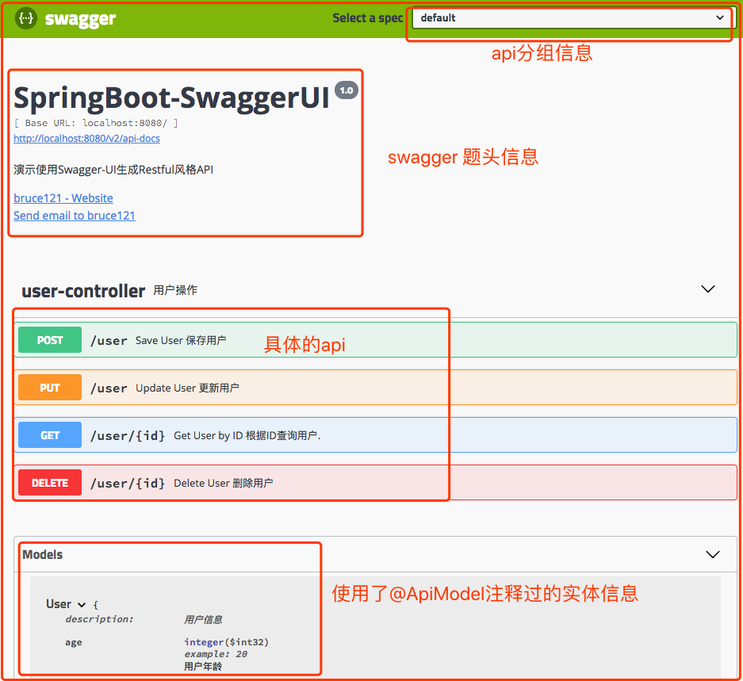

使用流程如下：
1.点击具体要测试的api---> 2.点击Try it out按钮 ---> 3.填写参数 ---> 4.点击execute执行请求，在下面就可以看到执行的结果了。

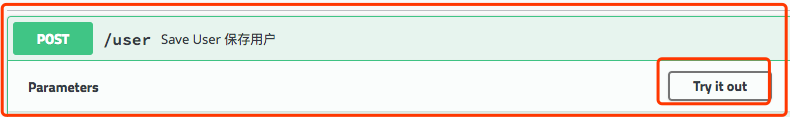  
    
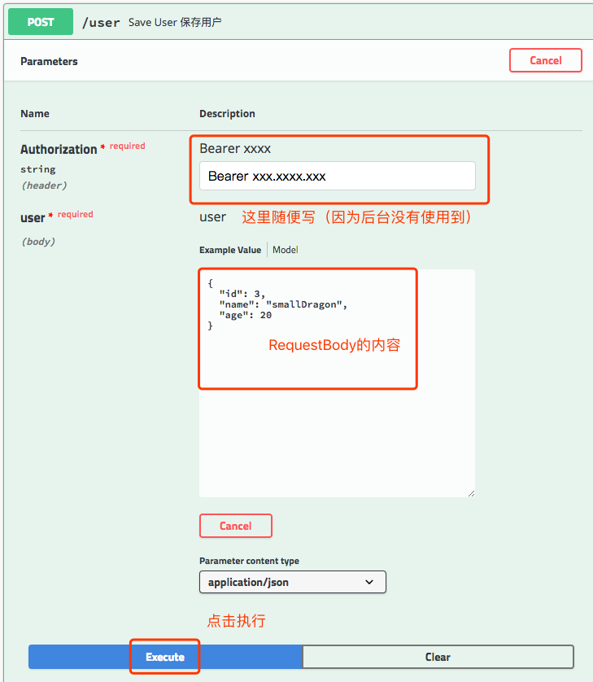

其余3个接口的测试过程就不贴图了，一样的过程。

**常用注解总结**：
>`@Api`：修饰整个类，描述Controller的作用   
>`@ApiOperation`：修饰方法，描述method作用    
>`@ApiIgnore`：修饰方法，让swagger忽略此文档    
>`@ApiImplicitParams`:修饰方法，添加隐含的请求参数（例如：请求头中的内容）    
>`@ApiParam`:修饰参数，方法和字段，描述作用    
>`@ApiModel`:修饰类，描述类的作用     
>`@ApiModelProperty`:修饰方法和字段，描述含义   
>其他略。。。

### 二、生成离线html文档
#### 1.先看效果图
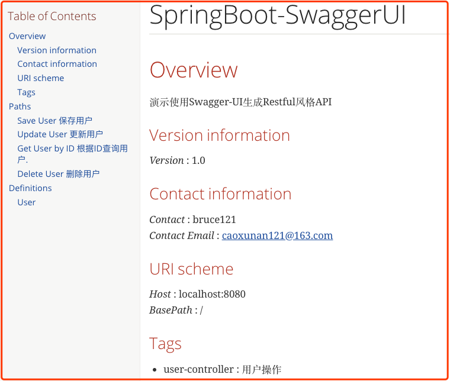

#### 2.添加swagger2markup插件
使用该插件讲swagger的json文档转换成AsciiDoc格式文档         
Swagger2markup简介：Swagger2markup是可以把Swagger-ui的Restful API文档转换成AsciiDoc或Markdown文档的转换器，用以简化最新的Restful-api文档（html，pdf）的生成。    
github链接：[https://github.com/Swagger2Markup](https://github.com/Swagger2Markup)         
这里用到的是该作者开发的插件，swagger2markup-maven-plugin插件使用说明文档链接：[http://swagger2markup.github.io/swagger2markup/1.3.3/#_maven_plugin](http://swagger2markup.github.io/swagger2markup/1.3.3/#_maven_plugin)

```
<!--http://swagger2markup.github.io/swagger2markup/1.3.3/#_maven_plugin-->
<plugin>
    <groupId>io.github.swagger2markup</groupId>
    <artifactId>swagger2markup-maven-plugin</artifactId>
    <version>1.3.6</version>
    <configuration>
        <!--
            The URL or file path to the Swagger specification
            注意：如果在Swagger的bean配置的时候，使用了分组配置的话，那么只访问http：//localhost:8080/v2/api-docs得不到任何内容，需要在后面通过group指定分组
            <swaggerInput>http://localhost:8080/v2/api-docs?group=show-swagger-ui</swaggerInput>
        -->
        <swaggerInput>http://localhost:8080/v2/api-docs</swaggerInput>
        <!--The directory where the output should be stored.-->
        <outputDir>src/docs/asciidoc/swagger</outputDir>
        <config>
            <swagger2markup.markupLanguage>ASCIIDOC</swagger2markup.markupLanguage>
        </config>
    </configuration>
</plugin>
```
**PS**：插件引入之后可以在idea的侧边栏看到刚才引入的插件，并且双击即可直接执行该插件。

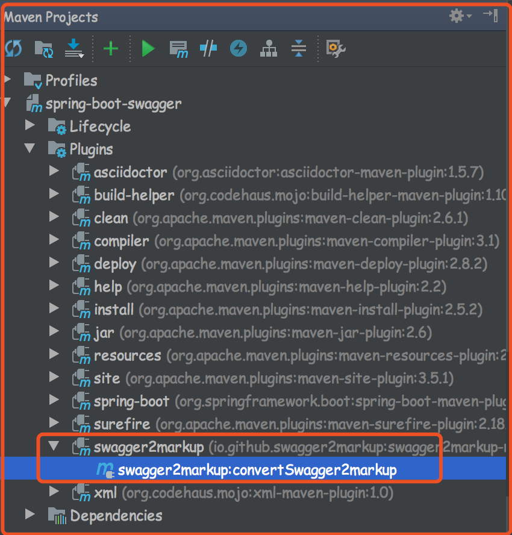

#### 3.运行插件
方式一：
mvn swagger2markup:convertSwagger2markup        
方式二：
直接双击该插件（执行）
```
[INFO] Scanning for projects...
[INFO]                                                                         
[INFO] ------------------------------------------------------------------------
[INFO] Building chapter6 0.0.1-SNAPSHOT
[INFO] ------------------------------------------------------------------------
[INFO] 
[INFO] --- swagger2markup-maven-plugin:1.3.4:convertSwagger2markup (default-cli) @ chapter6 ---
[INFO] reading from http://localhost:8080/v2/api-docs
[INFO] Markup document written to: /Users/caoxunan/learn-git/springboot-learn/chapter6/src/docs/asciidoc/swagger/overview.adoc
[INFO] Markup document written to: /Users/caoxunan/learn-git/springboot-learn/chapter6/src/docs/asciidoc/swagger/paths.adoc
[INFO] Markup document written to: /Users/caoxunan/learn-git/springboot-learn/chapter6/src/docs/asciidoc/swagger/definitions.adoc
[INFO] Markup document written to: /Users/caoxunan/learn-git/springboot-learn/chapter6/src/docs/asciidoc/swagger/security.adoc
[INFO] ------------------------------------------------------------------------
[INFO] BUILD SUCCESS
[INFO] ------------------------------------------------------------------------
[INFO] Total time: 1.795 s
[INFO] Finished at: 2018-11-11T16:24:52+08:00
[INFO] Final Memory: 20M/312M
[INFO] ------------------------------------------------------------------------
```
查看生成的文件     

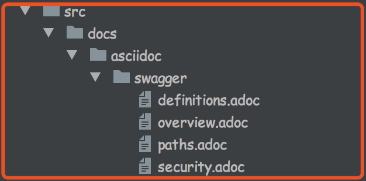

#### 4.添加asciidoctor-maven-plugin插件
再使用asciidoctor-maven-plugin插件，将AsciiDoc文档转换成html
插件链接：[https://github.com/asciidoctor/asciidoctor-maven-plugin](https://github.com/asciidoctor/asciidoctor-maven-plugin)
引入plugin
```
<!--https://github.com/asciidoctor/asciidoctor-maven-plugin-->
<plugin>
    <groupId>org.asciidoctor</groupId>
    <artifactId>asciidoctor-maven-plugin</artifactId>
    <version>1.5.7</version>

    <configuration>
        <!--指定asciidoc文档所在目录-->
        <sourceDirectory>src/docs/asciidoc/swagger</sourceDirectory>
        <!--html生成后所在的路径-->
        <outputDirectory>src/docs/asciidoc/html</outputDirectory>
        <!--默认是docbook，改为html5-->
        <backend>html5</backend>
        <!--启用语法高亮，设置语法高亮器（当前仅支持 coderay 和 highlight.js）-->
        <sourceHighlighter>coderay</sourceHighlighter>
        <!--包含传递给 Asciidoctor 的属性的 Map<String,Object>，默认为 null-->
        <attributes>
            <toc>left</toc>
        </attributes>
    </configuration>
</plugin>
```
idea中双击执行插件或者使用命令行：

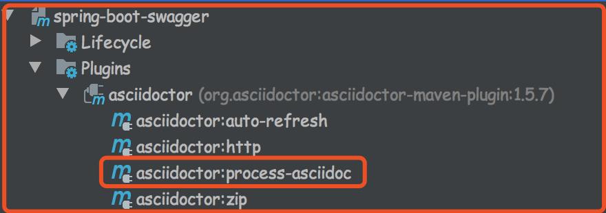

```
mvn asciidoctor:process-asciidoc
```
出现报错。。。
>Failed to load AsciiDoc document - undefined method `start_with?' for nil:NilClass

然后去该插件的github上找了一通，发现有人碰到过这个问题，然后有人提到说提升一下版本，我就把这个插件的版本提升到`v1.5.7.1`这个最新的版本了，重试了一下，问题解决。。就不深究这个问题了。

```
修改前：<version>1.5.7</version>
修改后：<version>1.5.7.1</version>
```
重新执行插件：
```
[INFO] ------------------------------------------------------------------------
[INFO] Building chapter6 0.0.1-SNAPSHOT
[INFO] ------------------------------------------------------------------------
[INFO] 
[INFO] --- asciidoctor-maven-plugin:1.5.7.1:process-asciidoc (default-cli) @ chapter6 ---
[INFO] Using 'UTF-8' encoding to copy filtered resources.
[INFO] Copying 0 resource
[INFO] Rendered /Users/caoxunan/learn-git/springboot-learn/chapter6/src/docs/asciidoc/swagger/security.adoc
[INFO] Rendered /Users/caoxunan/learn-git/springboot-learn/chapter6/src/docs/asciidoc/swagger/paths.adoc
[INFO] Rendered /Users/caoxunan/learn-git/springboot-learn/chapter6/src/docs/asciidoc/swagger/overview.adoc
[INFO] Rendered /Users/caoxunan/learn-git/springboot-learn/chapter6/src/docs/asciidoc/swagger/definitions.adoc
[INFO] ------------------------------------------------------------------------
[INFO] BUILD SUCCESS
[INFO] ------------------------------------------------------------------------
[INFO] Total time: 3.864 s
[INFO] Finished at: 2018-11-11T16:47:32+08:00
[INFO] Final Memory: 38M/454M
[INFO] ------------------------------------------------------------------------
```
#### 5.查看生成的文件

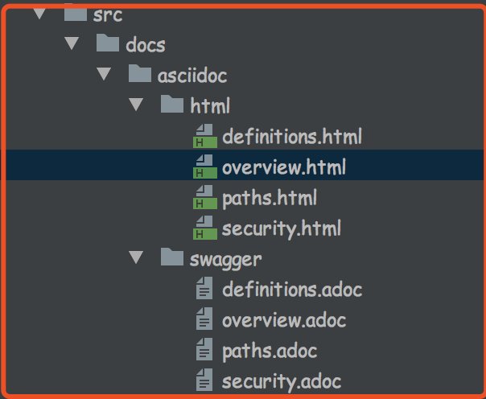

可以看到生成了4个不同的静态文件，可以修改一些配置，将生成的html合并成一个
```
swagger2markup插件配置：
<outputDir>src/docs/asciidoc/swagger</outputDir> 
改为
<outputFile>src/docs/asciidoc/swagger</outputFile>

然后修改一下acsiidoctor插件的扫描和生成目录
<sourceDirectory>src/docs/asciidoc/swagger</sourceDirectory>
<outputDirectory>src/docs/swagger/html</outputDirectory>
改为
<sourceDirectory>src/docs/asciidoc</sourceDirectory>
<outputDirectory>src/docs/</outputDirectory>
```
然后重新顺序执行2个插件，生成一整个文件：

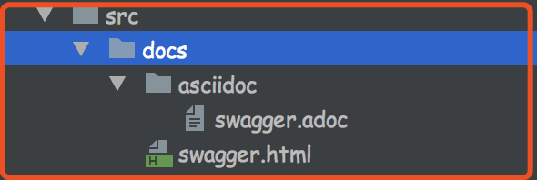

打开swagger.html看一下效果 


##### **PS1**:这个版本的swagger-ui界面看起来一点都不美观，个人更喜欢`2.6.1`这个版本样式的界面。
简洁大方

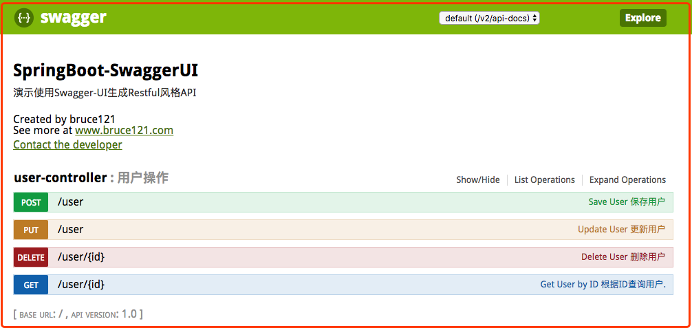

```
修改swagger相关依赖的版本
由   <version>2.9.2</version>
改为  <version>2.6.1</version>
```

重新启动项目，访问[http://localhost:8080/swagger-ui.html#/](http://localhost:8080/swagger-ui.html#/)     
出现意外：

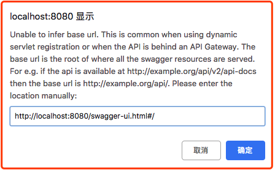

然后在这里找到了解决方案：[https://github.com/springfox/springfox/issues/1996](https://github.com/springfox/springfox/issues/1996)       
igor-holly讲到的清楚浏览器缓存。。。问题解决

##### **PS2**:一般情况下，我们只希望在本地和测试环境可以使用swagger-ui进行访问测试，而预生产及生产环境不允许访问，这个小需求我们可以通过条件注解来解决：      
修改`SwaggerConfig.java` 添加条件注解`@ConditionalOnProperty`
```
@ConditionalOnProperty(
        prefix = "configs.com.bruce121.swagger-ui",
        name = {"enabled"},
        havingValue = "true"
)
public class SwaggerConfig {...}
```
然后只有在配置文件中配置了`configs.com.bruce121.swagger-ui.enabled=true`才会构建这个SwaggerBean        
这样一来就可以通过这个配置来控制是否构造Swagger的Bean，间接控制是否可以通过swagger访问接口。
