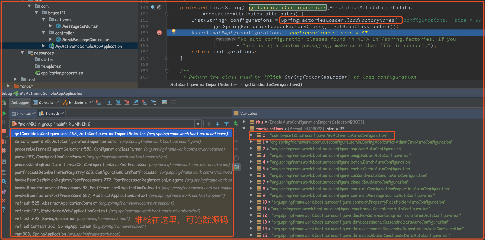
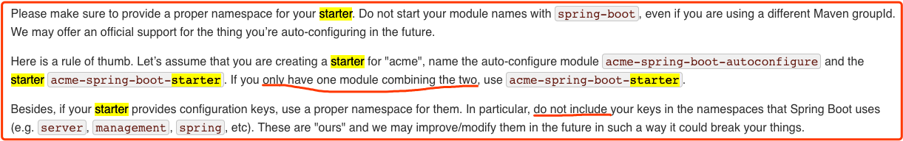
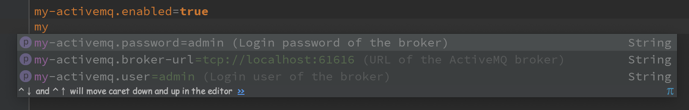

# 从头学Springboot系列(七) 自定义starter-实现ActiveMQ的自动配置
## 目录
* [目录](#目录)
* [前言](#前言)
* [正文](#正文)
    * [一 定义my-activemq-spring-boot-starter](#一-定义my-activemq-spring-boot-starter)
        * [1 创建普通maven项目并引入pom依赖](#1-创建普通maven项目并引入pom依赖)
        * [2 自定义属性封装类](#2-自定义属性封装类)
        * [3 定义自动配置类](#3-定义自动配置类)
        * [4 创建spring.factories](#4-创建springfactories)
    * [二 简单扩展](#二-简单扩展)
        * [1 导入新的pom依赖](#1-导入新的pom依赖)
        * [2 定义Producer(消息提供方)](#2-定义producer消息提供方)
        * [3 定义Consumer(消息消费方)](#3-定义consumer消息消费方)
        * [4 定义controller](#4-定义controller)
        * [5 打包源码](#5-打包源码)
    * [三 新建my-activemq-sample-app项目](#三-新建my-activemq-sample-app项目)
        * [1 导入pom依赖](#1-导入pom依赖)
        * [2 添加自定义配置](#2-添加自定义配置)
        * [3 启动测试](#3-启动测试)
        * [4 取消auto-configure](#4-取消auto-configure)
    * [四 基于导入的starter做开发](#四-基于导入的starter做开发)
        * [1 定义controller实现消息推送](#1-定义controller实现消息推送)
        * [2 定义consumer消费消息](#2-定义consumer消费消息)
        * [3 访问测试](#3-访问测试)
## 前言
这一章来自定义一个starter，实现ActiveMQ的自动配置，经过本章，就可以基本了解springboot的配置原理了，这也是第2章启动原理迟迟没写的原因之一，当有了实际的starter开发案例之后，回过头在去理解springBoot的启动原理就更加清晰明了了。

首先简单介绍一下实现过程，我们的项目启动是依赖`SpringApplication.run(XXX.class, args);`这行命令, 该命令执行后会在SpringApplication初始化之后，执行run()的过程中，会使用`SpringFactoriesLoader`这个类加载器扫描所有jar包下的`META-INF/spring.factories`这个文件，然后根据里面的内容，配置加载我们指定的AutoConfigure类.   
例如：     
`org.springframework.boot.autoconfigure.EnableAutoConfiguration=com.bruce121.autoconfigure.MyActivemqAutoConfiguration`     
意味着告诉springboot加载我们的指定的`MyActivemqAutoConfiguration`这个类，然后这个类会实现相应的自动配置并将Bean注入Spring Context上下文之中。   

<div align="left"></div>  

自定义starter有2种玩法，一种是分2个模块创建，即一个auto-configure模块，一个starter模块，这种创建的好处是可以单独引入auto-configure模块，然后只有对应的starter模块引入之后才会满足该模块自动配置的条件，触发自动配置。
另一种就是把2个模块合二为一，只创建一个模块，这种创建的好处是不用考虑那么多，直接导入starter就可以使用（我们采用的就是这种）。

自定义starter的命名方式为:{name}-spring-boot-starter,并且配置文件的namespace(前缀)不要包含server,management,spring等。

<div align="center"></div>

## 正文
### 一 定义my-activemq-spring-boot-starter
#### 1 创建普通maven项目并引入pom依赖
引入自定义starter需要的`spring-boot-autoconfigure`依赖以及`activemq`相关依赖
```
<dependency>
    <groupId>org.springframework.boot</groupId>
    <artifactId>spring-boot-autoconfigure</artifactId>
    <version>1.5.16.RELEASE</version>
</dependency>

<dependency>
    <groupId>org.springframework</groupId>
    <artifactId>spring-jms</artifactId>
    <version>4.3.19.RELEASE</version>
</dependency>

<dependency>
    <groupId>org.apache.activemq</groupId>
    <artifactId>activemq-spring</artifactId>
    <version>5.14.3</version>
</dependency>
```
#### 2 自定义属性封装类
因为使用了lombok的注解，所以先导入lombok的依赖
```
<dependency>
    <groupId>org.projectlombok</groupId>
    <artifactId>lombok</artifactId>
    <version>1.16.20</version>
</dependency>
```

```
@Getter
@Setter
@ConfigurationProperties(prefix = "my-activemq")
public class MyActivemqProperties {

    /**
     * Use for conditional annotation
     */
    private boolean enabled;

    /**
     * URL of the ActiveMQ broker. Auto-generated by default.
     */
    private String brokerUrl = "tcp://localhost:61616";

    /**
     * Login user of the broker.
     */
    private String user = "admin";

    /**
     * Login password of the broker.
     */
    private String password = "admin";

}
```
这里使用了`ConfigurationProperties`这个注解，如果使用了这个注解的话可以在pom中添加下面这个依赖(非必须)
```
<dependency>
    <groupId>org.springframework.boot</groupId>
    <artifactId>spring-boot-configuration-processor</artifactId>
    <version>1.5.16.RELEASE</version>
    <optional>true</optional>
</dependency>
```
因为有了这个依赖之后，项目在编译的过程中会自动在META-INF文件夹下生成`spring-configuration-metadata.json`文件，这个文件主要为IDE使用，可以给出提示，向下面这样   
   <div align="center"></div>

#### 3 定义自动配置类
```
@Configuration
@ConditionalOnClass({ConnectionFactory.class, ActiveMQConnectionFactory.class})
@ConditionalOnMissingBean(ConnectionFactory.class)
@EnableConfigurationProperties(MyActivemqProperties.class)
@ConditionalOnProperty(prefix = "my-activemq", value = "enabled", havingValue = "true", matchIfMissing = false)
@EnableJms
public class MyActivemqAutoConfiguration {
    private static Logger logger = LoggerFactory.getLogger(MyActivemqAutoConfiguration.class);

    @Autowired
    private MyActivemqProperties properties;

    @Bean
    public ActiveMQConnectionFactory activeMQConnectionFactory() {
        return new ActiveMQConnectionFactory(properties.getUser(), properties.getPassword(), properties.getBrokerUrl());
    }

    @Bean
    public JmsListenerContainerFactory jmsListenerContainerFactory() {
        DefaultJmsListenerContainerFactory factory = new DefaultJmsListenerContainerFactory();
        factory.setConnectionFactory(activeMQConnectionFactory());
        // DefaultMessageListenerContainer#setConcurrency
        factory.setConcurrency("5-10");
        // DefaultMessageListenerContainer#setRecoveryInterval
        factory.setRecoveryInterval(1000L);
        return factory;
    }

    @Bean
    @ConditionalOnMissingBean
    public JmsTemplate jmsTemplate(ActiveMQConnectionFactory connectionFactory) {
        if (connectionFactory == null) {
            logger.warn("ActiveMQConnectionFactory is null!");
        }
        return new JmsTemplate(connectionFactory);
    }

    @Bean
    @ConditionalOnMissingBean
    public JmsMessagingTemplate jmsMessagingTemplate(JmsTemplate jmsTemplate) {
        if (jmsTemplate == null) {
            logger.warn("JmsTemplate is null!");
        }
        return new JmsMessagingTemplate(jmsTemplate);
    }
}
```
注意：类头上的ConditionalOnClass会恒成立,如果分2个模块(auto-configure模块和对应starter模块)创建的话，这个条件注解的作用就体现出来了，只有当引入对应的starter模块，才会触发auto-configure模块的创建。
#### 4 创建spring.factories
在resources目录下创建文件夹`META-INF`，然后在META-INF文件夹下创建文件`spring.factories`,填写下面内容来指定其加载`MyActivemqAutoConfiguration`这个自动配置类。
```
org.springframework.boot.autoconfigure.EnableAutoConfiguration=com.bruce121.autoconfigure.MyActivemqAutoConfiguration
```
至此，这个starter已经创建完毕了，使用maven对其进行打包mvn install，而后在其他项目中引入该starter并添加对应配置就可以使用了，
但是在这里我简单做一下扩展，想实现这样一个效果：1 该starter中包含一个Controller，可直接通过url访问实现使用producer向特定消息队列推送消息,并且有特定的consumer消费消息。

### 二 简单扩展
#### 1 导入新的pom依赖
因为要用到web相关注解，直接导入web的starter相关模块
```
<dependency>
    <groupId>org.springframework.boot</groupId>
    <artifactId>spring-boot-starter-web</artifactId>
    <version>1.5.16.RELEASE</version>
</dependency>
```
#### 2 定义Producer(消息提供方)
```
@Service
@ConditionalOnProperty(prefix = "my-activemq", value = "enabled", havingValue = "true", matchIfMissing = false)
public class MyMessageProducer {

    @Autowired// 也可以注入JmsTemplate，JmsMessagingTemplate对JmsTemplate进行了封装
    private JmsMessagingTemplate jmsTemplate;

    // 发送消息，destination是发送到的队列，message是待发送的消息
    public void sendMessage(Destination destination, final String message) {
        jmsTemplate.convertAndSend(destination, message);
    }

}
```
#### 3 定义Consumer(消息消费方)
```
@Service
@ConditionalOnProperty(prefix = "my-activemq", value = "enabled", havingValue = "true", matchIfMissing = false)
public class MyMessageConsumer {

    // 使用JmsListener配置消费者监听的队列，其中text是接收到的消息
    @JmsListener(destination = "test.queue")
    @SendTo("out.queue")// 实现双向队列
    public String receiveQueue(String text) {
        // TODO do something
        System.out.println("Consumer--A-->>收到的报文为:" + text);
        return "out>>" + text;
    }

    @JmsListener(destination = "out.queue")
    public void receiveQueue1(String text) {
        // TODO do something
        System.out.println("Consumer--B-->>收到的报文为:" + text);
    }
}
```

#### 4 定义controller
```
@Controller
@RequestMapping(path = "/my-activemq")
@ConditionalOnProperty(prefix = "my-activemq", value = "enabled", havingValue = "true", matchIfMissing = false)
public class MyMessageController {

    @Value("${my-activemq.default_queue:test.queue}")
    private String defaultQueue;

    @Autowired
    private MyMessageProducer messageProducer;

    @RequestMapping(path = "/send/{message}", method = {RequestMethod.GET})
    @ResponseBody
    public String testSendMessage(@PathVariable String message) {
        Destination destination = new ActiveMQQueue(defaultQueue);
        // 发送消息
        messageProducer.sendMessage(destination, message);
        return "success";
    }
}
```
细心的人可能已经发现了，我在所有需要创建成Bean的类头都添加了`ConditionalOnProperty`条件注解，我的本意是想通过这个条件注解来实现是否启用这个自定义starter的自动配置。
#### 5 打包源码
到这里，这个自定义starter就全部完成了，可以使用mvn install 安装到本地仓库，然后在其他springboot项目中引入这个starter模块，然后在需要的情况下我们可以把这个starter的源码一起打包
打包源码的方式有2个（道理相同最终都是使用插件）：     
1.使用命令    mvn source:jar install        
2.使用插件
```
<build>
    <plugins>
        <plugin>
            <artifactId>maven-source-plugin</artifactId>
            <version>2.1</version>
            <configuration>
                <attach>true</attach>
            </configuration>
            <executions>
                <execution>
                    <phase>compile</phase><!--指定绑定的声明周期阶段-->
                    <goals>
                        <goal>jar</goal>
                    </goals>
                </execution>
            </executions>
        </plugin>
    </plugins>
</build>
```
在pom中引入插件后，正常使用mvn install命令就会在编译阶段触发插件，实现源码的打包。
### 三 新建my-activemq-sample-app项目
#### 1 导入pom依赖
新建一个springboot项目，然后导入web依赖模块和自定义的starter模块
```
<dependency>
	<groupId>org.springframework.boot</groupId>
	<artifactId>spring-boot-starter-web</artifactId>
</dependency>

<dependency>
	<groupId>com.bruce121</groupId>
	<artifactId>my-activemq-spring-boot-starter</artifactId>
	<version>1.0-SNAPSHOT</version>
</dependency>
```
#### 2 添加自定义配置
```
my-activemq.enabled=true
my-activemq.broker-url=tcp://localhost:61616
my-activemq.user=admin
my-activemq.password=admin
```
#### 3 启动测试
注意：因为我们自定义的activemq的自动配置，人家springboot已经有了相关自动配置类，所以为了排除其他不确定性的影响，我们将其原有的自动配置排除掉。
```
@SpringBootApplication(exclude = {JmsAutoConfiguration.class, ActiveMQAutoConfiguration.class}) 
```

启动项目后访问：[http://localhost:8080/my-activemq/send/message](http://localhost:8080/my-activemq/send/message)
可以看到控制台打印出消息已经被消费的信息：
>Consumer--A-->>收到的报文为:message      
>Consumer--B-->>收到的报文为:out>>message

这样就实现了整个自定义starter的创建及使用；
#### 4 取消auto-configure
只需要将`my-activemq.enabled`的值由`true`改为`false`即可，重新启动项目，项目不会报错，重新访问starter里面定义的url链接，会报404，因为由于条件注解`ConditionalOnProperty`的存在，当值为false的时候不会触发bean的自动装配。

### 四 基于导入的starter做开发
#### 1 定义controller实现消息推送
```
@Controller
public class SendMessageController {

    @Autowired
    private MyMessageProducer myMessageProducer;

    @ResponseBody
    @GetMapping("/demo/send/{message}")
    public String sendMessage(@PathVariable("message") String message) {
        Destination destination = new ActiveMQQueue("queue-one");
        myMessageProducer.sendMessage(destination, message);
        return "success";
    }
}
```
#### 2 定义consumer消费消息
```
@Service
public class MessageConsumer {

    @JmsListener(destination = "queue-one")
    public void receiveQueue(String text){
        // TODO 根据消息进行处理
        System.out.println("Get message:" + text);
    }
}
```
#### 3 访问测试
访问：[http://localhost:8080/demo/send/bruce121](http://localhost:8080/demo/send/bruce121)

<div align="left"></div>